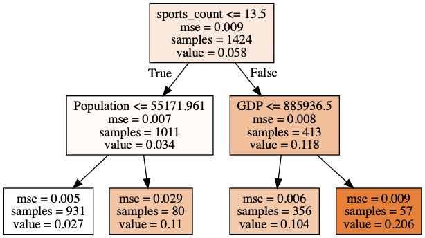
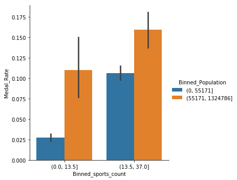
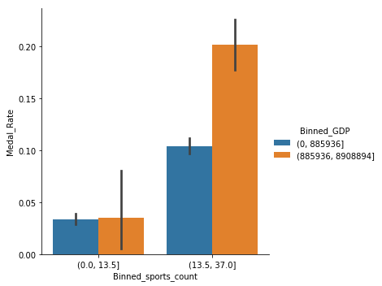
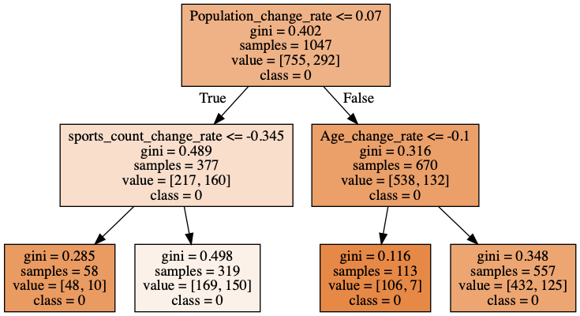
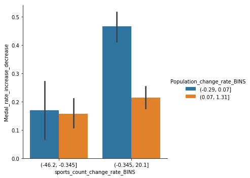
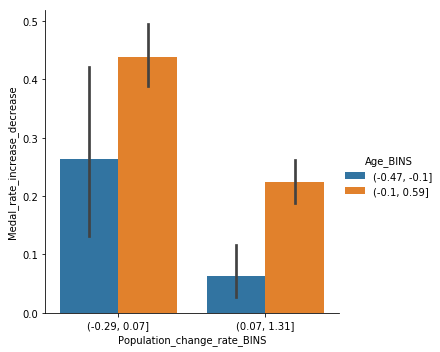

```python
import pandas as pd
import numpy as np
import seaborn as sns
%pylab inline

import sklearn as sk
import sklearn.tree as tree
from IPython.display import Image  
import pydotplus

import warnings
warnings.filterwarnings('ignore')
```

    Populating the interactive namespace from numpy and matplotlib


#### Import and clean GDP data


```python
gdp=pd.read_excel('GDP_ROLLING.xls')
gdp.head()
cols=gdp.columns.to_list()
cols[0]='Year'
gdp.columns=cols
gdp.set_index('Year',inplace=True)
```

#### Create GDP columns


```python
gdp_clean=gdp.copy()
gdp_clean=gdp_clean.stack().to_frame()
gdp_clean.reset_index(inplace=True)
gdp_clean.columns=['Year','Country','GDP']
gdp_clean.Country=gdp_clean.Country.str.lower()


```

#### Caculate GDP growth rate


```python
gdp_clean['GDP_shift']=gdp_clean.groupby('Country').GDP.shift(1)
gdp_clean['GDP_Growth_Rate']=100*(gdp_clean.GDP-gdp_clean.GDP_shift)/gdp_clean.GDP_shift
```

#### Import and clean population data


```python
popu1=pd.read_csv("POPU.csv")
```


```python
popu=popu1.copy()
b=popu.columns.to_list()
b[0]='country'
popu.columns=b
popu.head()
popu.set_index('country',inplace=True)
popu=popu.stack().to_frame()
popu.reset_index(inplace=True)
popu.columns=['Country','Year',"Population"]
popu.Country=popu.Country.str.lower()
popu_clean=popu
```

####  Import country dictionary data


```python
cd=pd.read_excel('noc.xls')
cd.columns=['NOC','region']
cd.region=cd.region.str.lower()
```

#### Import and clean Athlete_events data


```python
dff=pd.read_csv('athlete_events.csv')
```

#### set consistent NOC for regions that changed names


```python
dff.loc[dff['NOC'] == "TCH",'NOC'] = 'CZE'
dff.loc[dff['NOC'] == "FRG",'NOC'] = 'GER'
dff.loc[dff['NOC'] == "GDR",'NOC'] = 'GER'
dff.loc[dff['NOC'] == "MAL",'NOC'] = 'MAS'
dff.loc[dff['NOC'] == "NBO",'NOC'] = 'MAS'
dff.loc[dff['NOC'] == "EUN",'NOC'] = 'RUS'
dff.loc[dff['NOC'] == "URS",'NOC'] = 'RUS'
dff.loc[dff['NOC'] == "SCG",'NOC'] = 'SRB'
dff.loc[dff['NOC'] == "YUG",'NOC'] = 'SRB'
dff.loc[dff['NOC'] == "UAR",'NOC'] = 'SYR'
dff.loc[dff['NOC'] == "WIF",'NOC'] = 'TTO'
dff.loc[dff['NOC'] == "VNM",'NOC'] = 'VIE'
dff.loc[dff['NOC'] == "RHO",'NOC'] = 'ZIM'
dff.loc[dff['NOC'] == "YMD",'NOC'] = 'TEM'
dff.loc[dff['NOC'] == "YAR",'NOC'] = 'YEM'
```


```python
df=dff.copy()
df.head(5)
```


<div>
<style scoped>
    .dataframe tbody tr th:only-of-type {
        vertical-align: middle;
    }

    .dataframe tbody tr th {
        vertical-align: top;
    }

    .dataframe thead th {
        text-align: right;
    }
</style>
<table border="1" class="dataframe">
  <thead>
    <tr style="text-align: right;">
      <th></th>
      <th>ID</th>
      <th>Name</th>
      <th>Sex</th>
      <th>Age</th>
      <th>Height</th>
      <th>Weight</th>
      <th>Team</th>
      <th>NOC</th>
      <th>Games</th>
      <th>Year</th>
      <th>Season</th>
      <th>City</th>
      <th>Sport</th>
      <th>Event</th>
      <th>Medal</th>
    </tr>
  </thead>
  <tbody>
    <tr>
      <th>0</th>
      <td>1</td>
      <td>A Dijiang</td>
      <td>M</td>
      <td>24.0</td>
      <td>180.0</td>
      <td>80.0</td>
      <td>China</td>
      <td>CHN</td>
      <td>1992 Summer</td>
      <td>1992</td>
      <td>Summer</td>
      <td>Barcelona</td>
      <td>Basketball</td>
      <td>Basketball Men's Basketball</td>
      <td>NaN</td>
    </tr>
    <tr>
      <th>1</th>
      <td>2</td>
      <td>A Lamusi</td>
      <td>M</td>
      <td>23.0</td>
      <td>170.0</td>
      <td>60.0</td>
      <td>China</td>
      <td>CHN</td>
      <td>2012 Summer</td>
      <td>2012</td>
      <td>Summer</td>
      <td>London</td>
      <td>Judo</td>
      <td>Judo Men's Extra-Lightweight</td>
      <td>NaN</td>
    </tr>
    <tr>
      <th>2</th>
      <td>3</td>
      <td>Gunnar Nielsen Aaby</td>
      <td>M</td>
      <td>24.0</td>
      <td>NaN</td>
      <td>NaN</td>
      <td>Denmark</td>
      <td>DEN</td>
      <td>1920 Summer</td>
      <td>1920</td>
      <td>Summer</td>
      <td>Antwerpen</td>
      <td>Football</td>
      <td>Football Men's Football</td>
      <td>NaN</td>
    </tr>
    <tr>
      <th>3</th>
      <td>4</td>
      <td>Edgar Lindenau Aabye</td>
      <td>M</td>
      <td>34.0</td>
      <td>NaN</td>
      <td>NaN</td>
      <td>Denmark/Sweden</td>
      <td>DEN</td>
      <td>1900 Summer</td>
      <td>1900</td>
      <td>Summer</td>
      <td>Paris</td>
      <td>Tug-Of-War</td>
      <td>Tug-Of-War Men's Tug-Of-War</td>
      <td>Gold</td>
    </tr>
    <tr>
      <th>4</th>
      <td>5</td>
      <td>Christine Jacoba Aaftink</td>
      <td>F</td>
      <td>21.0</td>
      <td>185.0</td>
      <td>82.0</td>
      <td>Netherlands</td>
      <td>NED</td>
      <td>1988 Winter</td>
      <td>1988</td>
      <td>Winter</td>
      <td>Calgary</td>
      <td>Speed Skating</td>
      <td>Speed Skating Women's 500 metres</td>
      <td>NaN</td>
    </tr>
  </tbody>
</table>
</div>


#### Create new columns Medal_Rate, 1 for row contains gold, bronze or  silver, 0 for NaN


```python
df["Medal_Rate"]=~df.Medal.isna()*1
```

#### Create new columns Females, 1 for female and 0 for male


```python
df["Female"]=(df.Sex=='F')*1
```

#### Drop all irrelevant features


```python
df.drop(["ID","Name","City",'Games','Medal','Event'],axis=1, inplace=True)
```


```python
df.head(2)
```


<div>
<style scoped>
    .dataframe tbody tr th:only-of-type {
        vertical-align: middle;
    }

    .dataframe tbody tr th {
        vertical-align: top;
    }

    .dataframe thead th {
        text-align: right;
    }
</style>
<table border="1" class="dataframe">
  <thead>
    <tr style="text-align: right;">
      <th></th>
      <th>Sex</th>
      <th>Age</th>
      <th>Height</th>
      <th>Weight</th>
      <th>Team</th>
      <th>NOC</th>
      <th>Year</th>
      <th>Season</th>
      <th>Sport</th>
      <th>Medal_Rate</th>
      <th>Female</th>
    </tr>
  </thead>
  <tbody>
    <tr>
      <th>0</th>
      <td>M</td>
      <td>24.0</td>
      <td>180.0</td>
      <td>80.0</td>
      <td>China</td>
      <td>CHN</td>
      <td>1992</td>
      <td>Summer</td>
      <td>Basketball</td>
      <td>0</td>
      <td>0</td>
    </tr>
    <tr>
      <th>1</th>
      <td>M</td>
      <td>23.0</td>
      <td>170.0</td>
      <td>60.0</td>
      <td>China</td>
      <td>CHN</td>
      <td>2012</td>
      <td>Summer</td>
      <td>Judo</td>
      <td>0</td>
      <td>0</td>
    </tr>
  </tbody>
</table>
</div>


```python
df.Year[df.Season=='Summer'].unique()
```


    array([1992, 2012, 1920, 1900, 1932, 1952, 2000, 1996, 1912, 1924, 1948,
           2008, 2016, 2004, 1984, 1968, 1972, 1988, 1936, 1956, 1960, 1928,
           1976, 1980, 1964, 1906, 1904, 1908, 1896])


```python
df.Year[df.Season=='Winter'].unique()
```


    array([1988, 1992, 1994, 2002, 1980, 2014, 1998, 2006, 1960, 1964, 1984,
           1952, 1956, 2010, 1968, 1972, 1976, 1924, 1928, 1948, 1932, 1936])


#### Create dataframe 1 whose row represents each year, every country's athelets' average age, Height, Weight, Medal rate and Female ratio


```python
df1=df.groupby(['NOC','Year'],as_index=False).mean()
```


```python
df1.head(2)
```


<div>
<style scoped>
    .dataframe tbody tr th:only-of-type {
        vertical-align: middle;
    }

    .dataframe tbody tr th {
        vertical-align: top;
    }

    .dataframe thead th {
        text-align: right;
    }
</style>
<table border="1" class="dataframe">
  <thead>
    <tr style="text-align: right;">
      <th></th>
      <th>NOC</th>
      <th>Year</th>
      <th>Age</th>
      <th>Height</th>
      <th>Weight</th>
      <th>Medal_Rate</th>
      <th>Female</th>
    </tr>
  </thead>
  <tbody>
    <tr>
      <th>0</th>
      <td>AFG</td>
      <td>1936</td>
      <td>24.266667</td>
      <td>NaN</td>
      <td>NaN</td>
      <td>0.0</td>
      <td>0.0</td>
    </tr>
    <tr>
      <th>1</th>
      <td>AFG</td>
      <td>1948</td>
      <td>NaN</td>
      <td>NaN</td>
      <td>NaN</td>
      <td>0.0</td>
      <td>0.0</td>
    </tr>
  </tbody>
</table>
</div>


#### Create new feature as previous medal rate


```python
df1['Previous_Medal_Rate']=df1.groupby('NOC').Medal_Rate.shift(1)
```

#### Create new feature indicate whether medal rate increase(1) or decrease(0) comparing with previous event's medal_rate


```python
df1['Medal_rate_increase_decrease']=((df1.Medal_Rate-df1.Previous_Medal_Rate)>0)*1
```

####  Create new feature indicate the number of sports each country attended


```python
df1['sports_count']=(df.groupby(['NOC','Year'],as_index=False)).Sport.nunique()
```

#### Merge country dictionary and athelete events dataframe df1


```python
df2 = pd.merge(df1,cd,  how='left', left_on=['NOC'], right_on = ["NOC"])

```


```python
df2
```


<div>
<style scoped>
    .dataframe tbody tr th:only-of-type {
        vertical-align: middle;
    }

    .dataframe tbody tr th {
        vertical-align: top;
    }

    .dataframe thead th {
        text-align: right;
    }
</style>
<table border="1" class="dataframe">
  <thead>
    <tr style="text-align: right;">
      <th></th>
      <th>NOC</th>
      <th>Year</th>
      <th>Age</th>
      <th>Height</th>
      <th>Weight</th>
      <th>Medal_Rate</th>
      <th>Female</th>
      <th>Previous_Medal_Rate</th>
      <th>Medal_rate_increase_decrease</th>
      <th>sports_count</th>
      <th>region</th>
    </tr>
  </thead>
  <tbody>
    <tr>
      <th>0</th>
      <td>AFG</td>
      <td>1936</td>
      <td>24.266667</td>
      <td>NaN</td>
      <td>NaN</td>
      <td>0.000000</td>
      <td>0.000000</td>
      <td>NaN</td>
      <td>0</td>
      <td>2</td>
      <td>afghanistan</td>
    </tr>
    <tr>
      <th>1</th>
      <td>AFG</td>
      <td>1948</td>
      <td>NaN</td>
      <td>NaN</td>
      <td>NaN</td>
      <td>0.000000</td>
      <td>0.000000</td>
      <td>0.000000</td>
      <td>0</td>
      <td>2</td>
      <td>afghanistan</td>
    </tr>
    <tr>
      <th>2</th>
      <td>AFG</td>
      <td>1956</td>
      <td>NaN</td>
      <td>NaN</td>
      <td>NaN</td>
      <td>0.000000</td>
      <td>0.000000</td>
      <td>0.000000</td>
      <td>0</td>
      <td>1</td>
      <td>afghanistan</td>
    </tr>
    <tr>
      <th>3</th>
      <td>AFG</td>
      <td>1960</td>
      <td>23.312500</td>
      <td>170.687500</td>
      <td>69.437500</td>
      <td>0.000000</td>
      <td>0.000000</td>
      <td>0.000000</td>
      <td>0</td>
      <td>2</td>
      <td>afghanistan</td>
    </tr>
    <tr>
      <th>4</th>
      <td>AFG</td>
      <td>1964</td>
      <td>22.000000</td>
      <td>161.000000</td>
      <td>64.250000</td>
      <td>0.000000</td>
      <td>0.000000</td>
      <td>0.000000</td>
      <td>0</td>
      <td>1</td>
      <td>afghanistan</td>
    </tr>
    <tr>
      <th>5</th>
      <td>AFG</td>
      <td>1968</td>
      <td>23.200000</td>
      <td>170.200000</td>
      <td>70.000000</td>
      <td>0.000000</td>
      <td>0.000000</td>
      <td>0.000000</td>
      <td>0</td>
      <td>1</td>
      <td>afghanistan</td>
    </tr>
    <tr>
      <th>6</th>
      <td>AFG</td>
      <td>1972</td>
      <td>29.000000</td>
      <td>168.333333</td>
      <td>63.750000</td>
      <td>0.000000</td>
      <td>0.000000</td>
      <td>0.000000</td>
      <td>0</td>
      <td>1</td>
      <td>afghanistan</td>
    </tr>
    <tr>
      <th>7</th>
      <td>AFG</td>
      <td>1980</td>
      <td>23.636364</td>
      <td>168.363636</td>
      <td>63.181818</td>
      <td>0.000000</td>
      <td>0.000000</td>
      <td>0.000000</td>
      <td>0</td>
      <td>2</td>
      <td>afghanistan</td>
    </tr>
    <tr>
      <th>8</th>
      <td>AFG</td>
      <td>1988</td>
      <td>NaN</td>
      <td>NaN</td>
      <td>NaN</td>
      <td>0.000000</td>
      <td>0.000000</td>
      <td>0.000000</td>
      <td>0</td>
      <td>1</td>
      <td>afghanistan</td>
    </tr>
    <tr>
      <th>9</th>
      <td>AFG</td>
      <td>1996</td>
      <td>23.500000</td>
      <td>NaN</td>
      <td>NaN</td>
      <td>0.000000</td>
      <td>0.000000</td>
      <td>0.000000</td>
      <td>0</td>
      <td>1</td>
      <td>afghanistan</td>
    </tr>
    <tr>
      <th>10</th>
      <td>AFG</td>
      <td>2004</td>
      <td>18.600000</td>
      <td>170.750000</td>
      <td>64.750000</td>
      <td>0.000000</td>
      <td>0.400000</td>
      <td>0.000000</td>
      <td>0</td>
      <td>4</td>
      <td>afghanistan</td>
    </tr>
    <tr>
      <th>11</th>
      <td>AFG</td>
      <td>2008</td>
      <td>22.500000</td>
      <td>179.250000</td>
      <td>62.750000</td>
      <td>0.250000</td>
      <td>0.250000</td>
      <td>0.000000</td>
      <td>1</td>
      <td>2</td>
      <td>afghanistan</td>
    </tr>
    <tr>
      <th>12</th>
      <td>AFG</td>
      <td>2012</td>
      <td>24.833333</td>
      <td>171.666667</td>
      <td>60.833333</td>
      <td>0.166667</td>
      <td>0.166667</td>
      <td>0.250000</td>
      <td>0</td>
      <td>4</td>
      <td>afghanistan</td>
    </tr>
    <tr>
      <th>13</th>
      <td>AFG</td>
      <td>2016</td>
      <td>24.666667</td>
      <td>173.666667</td>
      <td>74.000000</td>
      <td>0.000000</td>
      <td>0.333333</td>
      <td>0.166667</td>
      <td>0</td>
      <td>2</td>
      <td>afghanistan</td>
    </tr>
    <tr>
      <th>14</th>
      <td>AHO</td>
      <td>1952</td>
      <td>23.090909</td>
      <td>NaN</td>
      <td>NaN</td>
      <td>0.000000</td>
      <td>0.000000</td>
      <td>NaN</td>
      <td>0</td>
      <td>1</td>
      <td>curacao</td>
    </tr>
    <tr>
      <th>15</th>
      <td>AHO</td>
      <td>1960</td>
      <td>26.200000</td>
      <td>170.200000</td>
      <td>83.900000</td>
      <td>0.000000</td>
      <td>0.000000</td>
      <td>0.000000</td>
      <td>0</td>
      <td>1</td>
      <td>curacao</td>
    </tr>
    <tr>
      <th>16</th>
      <td>AHO</td>
      <td>1964</td>
      <td>28.500000</td>
      <td>171.250000</td>
      <td>69.375000</td>
      <td>0.000000</td>
      <td>0.000000</td>
      <td>0.000000</td>
      <td>0</td>
      <td>2</td>
      <td>curacao</td>
    </tr>
    <tr>
      <th>17</th>
      <td>AHO</td>
      <td>1968</td>
      <td>31.000000</td>
      <td>173.200000</td>
      <td>67.800000</td>
      <td>0.000000</td>
      <td>0.400000</td>
      <td>0.000000</td>
      <td>0</td>
      <td>2</td>
      <td>curacao</td>
    </tr>
    <tr>
      <th>18</th>
      <td>AHO</td>
      <td>1972</td>
      <td>38.500000</td>
      <td>164.000000</td>
      <td>86.000000</td>
      <td>0.000000</td>
      <td>0.000000</td>
      <td>0.000000</td>
      <td>0</td>
      <td>2</td>
      <td>curacao</td>
    </tr>
    <tr>
      <th>19</th>
      <td>AHO</td>
      <td>1976</td>
      <td>27.333333</td>
      <td>174.500000</td>
      <td>66.000000</td>
      <td>0.000000</td>
      <td>0.000000</td>
      <td>0.000000</td>
      <td>0</td>
      <td>2</td>
      <td>curacao</td>
    </tr>
    <tr>
      <th>20</th>
      <td>AHO</td>
      <td>1984</td>
      <td>18.230769</td>
      <td>181.111111</td>
      <td>69.777778</td>
      <td>0.000000</td>
      <td>0.538462</td>
      <td>0.000000</td>
      <td>0</td>
      <td>3</td>
      <td>curacao</td>
    </tr>
    <tr>
      <th>21</th>
      <td>AHO</td>
      <td>1988</td>
      <td>28.714286</td>
      <td>193.000000</td>
      <td>80.000000</td>
      <td>0.142857</td>
      <td>0.142857</td>
      <td>0.000000</td>
      <td>1</td>
      <td>5</td>
      <td>curacao</td>
    </tr>
    <tr>
      <th>22</th>
      <td>AHO</td>
      <td>1992</td>
      <td>29.666667</td>
      <td>178.666667</td>
      <td>83.000000</td>
      <td>0.000000</td>
      <td>0.166667</td>
      <td>0.142857</td>
      <td>0</td>
      <td>4</td>
      <td>curacao</td>
    </tr>
    <tr>
      <th>23</th>
      <td>AHO</td>
      <td>1996</td>
      <td>30.142857</td>
      <td>178.000000</td>
      <td>83.250000</td>
      <td>0.000000</td>
      <td>0.000000</td>
      <td>0.000000</td>
      <td>0</td>
      <td>5</td>
      <td>curacao</td>
    </tr>
    <tr>
      <th>24</th>
      <td>AHO</td>
      <td>2000</td>
      <td>30.625000</td>
      <td>179.125000</td>
      <td>79.625000</td>
      <td>0.000000</td>
      <td>0.125000</td>
      <td>0.000000</td>
      <td>0</td>
      <td>6</td>
      <td>curacao</td>
    </tr>
    <tr>
      <th>25</th>
      <td>AHO</td>
      <td>2004</td>
      <td>32.333333</td>
      <td>183.666667</td>
      <td>80.000000</td>
      <td>0.000000</td>
      <td>0.000000</td>
      <td>0.000000</td>
      <td>0</td>
      <td>2</td>
      <td>curacao</td>
    </tr>
    <tr>
      <th>26</th>
      <td>AHO</td>
      <td>2008</td>
      <td>23.000000</td>
      <td>178.750000</td>
      <td>74.500000</td>
      <td>0.000000</td>
      <td>0.000000</td>
      <td>0.000000</td>
      <td>0</td>
      <td>3</td>
      <td>curacao</td>
    </tr>
    <tr>
      <th>27</th>
      <td>ALB</td>
      <td>1972</td>
      <td>26.800000</td>
      <td>NaN</td>
      <td>59.000000</td>
      <td>0.000000</td>
      <td>0.200000</td>
      <td>NaN</td>
      <td>0</td>
      <td>2</td>
      <td>albania</td>
    </tr>
    <tr>
      <th>28</th>
      <td>ALB</td>
      <td>1992</td>
      <td>25.333333</td>
      <td>163.000000</td>
      <td>75.250000</td>
      <td>0.000000</td>
      <td>0.222222</td>
      <td>0.000000</td>
      <td>0</td>
      <td>4</td>
      <td>albania</td>
    </tr>
    <tr>
      <th>29</th>
      <td>ALB</td>
      <td>1996</td>
      <td>26.777778</td>
      <td>169.000000</td>
      <td>67.500000</td>
      <td>0.000000</td>
      <td>0.666667</td>
      <td>0.000000</td>
      <td>0</td>
      <td>5</td>
      <td>albania</td>
    </tr>
    <tr>
      <th>...</th>
      <td>...</td>
      <td>...</td>
      <td>...</td>
      <td>...</td>
      <td>...</td>
      <td>...</td>
      <td>...</td>
      <td>...</td>
      <td>...</td>
      <td>...</td>
      <td>...</td>
    </tr>
    <tr>
      <th>3267</th>
      <td>YEM</td>
      <td>2008</td>
      <td>21.375000</td>
      <td>165.428571</td>
      <td>55.571429</td>
      <td>0.000000</td>
      <td>0.125000</td>
      <td>0.000000</td>
      <td>0</td>
      <td>4</td>
      <td>yemen</td>
    </tr>
    <tr>
      <th>3268</th>
      <td>YEM</td>
      <td>2012</td>
      <td>20.000000</td>
      <td>169.000000</td>
      <td>58.000000</td>
      <td>0.000000</td>
      <td>0.250000</td>
      <td>0.000000</td>
      <td>0</td>
      <td>3</td>
      <td>yemen</td>
    </tr>
    <tr>
      <th>3269</th>
      <td>YEM</td>
      <td>2016</td>
      <td>19.333333</td>
      <td>169.666667</td>
      <td>65.666667</td>
      <td>0.000000</td>
      <td>0.333333</td>
      <td>0.000000</td>
      <td>0</td>
      <td>3</td>
      <td>yemen</td>
    </tr>
    <tr>
      <th>3270</th>
      <td>ZAM</td>
      <td>1964</td>
      <td>21.666667</td>
      <td>175.733333</td>
      <td>68.000000</td>
      <td>0.000000</td>
      <td>0.066667</td>
      <td>NaN</td>
      <td>0</td>
      <td>5</td>
      <td>zambia</td>
    </tr>
    <tr>
      <th>3271</th>
      <td>ZAM</td>
      <td>1968</td>
      <td>20.142857</td>
      <td>175.250000</td>
      <td>60.250000</td>
      <td>0.000000</td>
      <td>0.000000</td>
      <td>0.000000</td>
      <td>0</td>
      <td>2</td>
      <td>zambia</td>
    </tr>
    <tr>
      <th>3272</th>
      <td>ZAM</td>
      <td>1972</td>
      <td>21.166667</td>
      <td>168.500000</td>
      <td>58.250000</td>
      <td>0.000000</td>
      <td>0.333333</td>
      <td>0.000000</td>
      <td>0</td>
      <td>2</td>
      <td>zambia</td>
    </tr>
    <tr>
      <th>3273</th>
      <td>ZAM</td>
      <td>1980</td>
      <td>27.227273</td>
      <td>174.214286</td>
      <td>67.950000</td>
      <td>0.000000</td>
      <td>0.000000</td>
      <td>0.000000</td>
      <td>0</td>
      <td>4</td>
      <td>zambia</td>
    </tr>
    <tr>
      <th>3274</th>
      <td>ZAM</td>
      <td>1984</td>
      <td>22.300000</td>
      <td>173.714286</td>
      <td>67.800000</td>
      <td>0.055556</td>
      <td>0.000000</td>
      <td>0.000000</td>
      <td>1</td>
      <td>3</td>
      <td>zambia</td>
    </tr>
    <tr>
      <th>3275</th>
      <td>ZAM</td>
      <td>1988</td>
      <td>24.030303</td>
      <td>172.781250</td>
      <td>68.093750</td>
      <td>0.000000</td>
      <td>0.000000</td>
      <td>0.055556</td>
      <td>0</td>
      <td>3</td>
      <td>zambia</td>
    </tr>
    <tr>
      <th>3276</th>
      <td>ZAM</td>
      <td>1992</td>
      <td>22.818182</td>
      <td>169.714286</td>
      <td>64.428571</td>
      <td>0.000000</td>
      <td>0.272727</td>
      <td>0.000000</td>
      <td>0</td>
      <td>3</td>
      <td>zambia</td>
    </tr>
    <tr>
      <th>3277</th>
      <td>ZAM</td>
      <td>1996</td>
      <td>25.750000</td>
      <td>170.166667</td>
      <td>60.571429</td>
      <td>0.125000</td>
      <td>0.125000</td>
      <td>0.000000</td>
      <td>1</td>
      <td>2</td>
      <td>zambia</td>
    </tr>
    <tr>
      <th>3278</th>
      <td>ZAM</td>
      <td>2000</td>
      <td>23.000000</td>
      <td>173.166667</td>
      <td>64.833333</td>
      <td>0.000000</td>
      <td>0.250000</td>
      <td>0.125000</td>
      <td>0</td>
      <td>3</td>
      <td>zambia</td>
    </tr>
    <tr>
      <th>3279</th>
      <td>ZAM</td>
      <td>2004</td>
      <td>22.500000</td>
      <td>173.666667</td>
      <td>64.500000</td>
      <td>0.000000</td>
      <td>0.333333</td>
      <td>0.000000</td>
      <td>0</td>
      <td>3</td>
      <td>zambia</td>
    </tr>
    <tr>
      <th>3280</th>
      <td>ZAM</td>
      <td>2008</td>
      <td>21.875000</td>
      <td>168.714286</td>
      <td>62.750000</td>
      <td>0.000000</td>
      <td>0.250000</td>
      <td>0.000000</td>
      <td>0</td>
      <td>4</td>
      <td>zambia</td>
    </tr>
    <tr>
      <th>3281</th>
      <td>ZAM</td>
      <td>2012</td>
      <td>22.571429</td>
      <td>176.166667</td>
      <td>74.166667</td>
      <td>0.000000</td>
      <td>0.285714</td>
      <td>0.000000</td>
      <td>0</td>
      <td>4</td>
      <td>zambia</td>
    </tr>
    <tr>
      <th>3282</th>
      <td>ZAM</td>
      <td>2016</td>
      <td>24.142857</td>
      <td>175.166667</td>
      <td>67.500000</td>
      <td>0.000000</td>
      <td>0.285714</td>
      <td>0.000000</td>
      <td>0</td>
      <td>4</td>
      <td>zambia</td>
    </tr>
    <tr>
      <th>3283</th>
      <td>ZIM</td>
      <td>1928</td>
      <td>20.000000</td>
      <td>NaN</td>
      <td>NaN</td>
      <td>0.000000</td>
      <td>0.000000</td>
      <td>NaN</td>
      <td>0</td>
      <td>1</td>
      <td>zimbabwe</td>
    </tr>
    <tr>
      <th>3284</th>
      <td>ZIM</td>
      <td>1960</td>
      <td>20.636364</td>
      <td>162.818182</td>
      <td>62.272727</td>
      <td>0.000000</td>
      <td>0.500000</td>
      <td>0.000000</td>
      <td>0</td>
      <td>6</td>
      <td>zimbabwe</td>
    </tr>
    <tr>
      <th>3285</th>
      <td>ZIM</td>
      <td>1964</td>
      <td>25.303030</td>
      <td>174.454545</td>
      <td>70.393939</td>
      <td>0.000000</td>
      <td>0.181818</td>
      <td>0.000000</td>
      <td>0</td>
      <td>7</td>
      <td>zimbabwe</td>
    </tr>
    <tr>
      <th>3286</th>
      <td>ZIM</td>
      <td>1980</td>
      <td>26.941176</td>
      <td>171.942308</td>
      <td>70.980769</td>
      <td>0.288462</td>
      <td>0.423077</td>
      <td>0.000000</td>
      <td>1</td>
      <td>10</td>
      <td>zimbabwe</td>
    </tr>
    <tr>
      <th>3287</th>
      <td>ZIM</td>
      <td>1984</td>
      <td>29.100000</td>
      <td>173.950000</td>
      <td>67.550000</td>
      <td>0.000000</td>
      <td>0.150000</td>
      <td>0.288462</td>
      <td>0</td>
      <td>5</td>
      <td>zimbabwe</td>
    </tr>
    <tr>
      <th>3288</th>
      <td>ZIM</td>
      <td>1988</td>
      <td>25.106383</td>
      <td>176.489362</td>
      <td>70.319149</td>
      <td>0.000000</td>
      <td>0.191489</td>
      <td>0.000000</td>
      <td>0</td>
      <td>10</td>
      <td>zimbabwe</td>
    </tr>
    <tr>
      <th>3289</th>
      <td>ZIM</td>
      <td>1992</td>
      <td>21.214286</td>
      <td>171.142857</td>
      <td>62.428571</td>
      <td>0.000000</td>
      <td>0.428571</td>
      <td>0.000000</td>
      <td>0</td>
      <td>6</td>
      <td>zimbabwe</td>
    </tr>
    <tr>
      <th>3290</th>
      <td>ZIM</td>
      <td>1996</td>
      <td>23.761905</td>
      <td>176.705882</td>
      <td>68.666667</td>
      <td>0.000000</td>
      <td>0.142857</td>
      <td>0.000000</td>
      <td>0</td>
      <td>6</td>
      <td>zimbabwe</td>
    </tr>
    <tr>
      <th>3291</th>
      <td>ZIM</td>
      <td>2000</td>
      <td>24.961538</td>
      <td>178.960000</td>
      <td>71.080000</td>
      <td>0.000000</td>
      <td>0.307692</td>
      <td>0.000000</td>
      <td>0</td>
      <td>5</td>
      <td>zimbabwe</td>
    </tr>
    <tr>
      <th>3292</th>
      <td>ZIM</td>
      <td>2004</td>
      <td>25.071429</td>
      <td>177.785714</td>
      <td>70.500000</td>
      <td>0.214286</td>
      <td>0.357143</td>
      <td>0.000000</td>
      <td>1</td>
      <td>4</td>
      <td>zimbabwe</td>
    </tr>
    <tr>
      <th>3293</th>
      <td>ZIM</td>
      <td>2008</td>
      <td>26.062500</td>
      <td>171.928571</td>
      <td>63.714286</td>
      <td>0.250000</td>
      <td>0.500000</td>
      <td>0.214286</td>
      <td>1</td>
      <td>6</td>
      <td>zimbabwe</td>
    </tr>
    <tr>
      <th>3294</th>
      <td>ZIM</td>
      <td>2012</td>
      <td>27.333333</td>
      <td>174.444444</td>
      <td>65.222222</td>
      <td>0.000000</td>
      <td>0.555556</td>
      <td>0.250000</td>
      <td>0</td>
      <td>4</td>
      <td>zimbabwe</td>
    </tr>
    <tr>
      <th>3295</th>
      <td>ZIM</td>
      <td>2014</td>
      <td>20.000000</td>
      <td>182.000000</td>
      <td>81.000000</td>
      <td>0.000000</td>
      <td>0.000000</td>
      <td>0.000000</td>
      <td>0</td>
      <td>1</td>
      <td>zimbabwe</td>
    </tr>
    <tr>
      <th>3296</th>
      <td>ZIM</td>
      <td>2016</td>
      <td>27.483871</td>
      <td>167.838710</td>
      <td>62.193548</td>
      <td>0.000000</td>
      <td>0.709677</td>
      <td>0.000000</td>
      <td>0</td>
      <td>7</td>
      <td>zimbabwe</td>
    </tr>
  </tbody>
</table>
<p>3297 rows × 11 columns</p>
</div>


#### Merge df2 and gpd dataframe as df3


```python
df3=pd.merge(df2,gdp_clean,how='left', left_on=['region','Year'], right_on = ['Country','Year'])
```


```python
gdp_clean
```


<div>
<style scoped>
    .dataframe tbody tr th:only-of-type {
        vertical-align: middle;
    }

    .dataframe tbody tr th {
        vertical-align: top;
    }

    .dataframe thead th {
        text-align: right;
    }
</style>
<table border="1" class="dataframe">
  <thead>
    <tr style="text-align: right;">
      <th></th>
      <th>Year</th>
      <th>Country</th>
      <th>GDP</th>
      <th>GDP_shift</th>
      <th>GDP_Growth_Rate</th>
    </tr>
  </thead>
  <tbody>
    <tr>
      <th>0</th>
      <td>1949</td>
      <td>austria</td>
      <td>2.286472e+04</td>
      <td>NaN</td>
      <td>NaN</td>
    </tr>
    <tr>
      <th>1</th>
      <td>1949</td>
      <td>belgium</td>
      <td>4.473590e+04</td>
      <td>NaN</td>
      <td>NaN</td>
    </tr>
    <tr>
      <th>2</th>
      <td>1949</td>
      <td>denmark</td>
      <td>2.747118e+04</td>
      <td>NaN</td>
      <td>NaN</td>
    </tr>
    <tr>
      <th>3</th>
      <td>1949</td>
      <td>finland</td>
      <td>1.641973e+04</td>
      <td>NaN</td>
      <td>NaN</td>
    </tr>
    <tr>
      <th>4</th>
      <td>1949</td>
      <td>france</td>
      <td>2.051744e+05</td>
      <td>NaN</td>
      <td>NaN</td>
    </tr>
    <tr>
      <th>5</th>
      <td>1949</td>
      <td>germany</td>
      <td>2.231780e+05</td>
      <td>NaN</td>
      <td>NaN</td>
    </tr>
    <tr>
      <th>6</th>
      <td>1949</td>
      <td>italy</td>
      <td>1.525631e+05</td>
      <td>NaN</td>
      <td>NaN</td>
    </tr>
    <tr>
      <th>7</th>
      <td>1949</td>
      <td>netherlands</td>
      <td>5.854600e+04</td>
      <td>NaN</td>
      <td>NaN</td>
    </tr>
    <tr>
      <th>8</th>
      <td>1949</td>
      <td>norway</td>
      <td>1.690476e+04</td>
      <td>NaN</td>
      <td>NaN</td>
    </tr>
    <tr>
      <th>9</th>
      <td>1949</td>
      <td>sweden</td>
      <td>4.569400e+04</td>
      <td>NaN</td>
      <td>NaN</td>
    </tr>
    <tr>
      <th>10</th>
      <td>1949</td>
      <td>switzerland</td>
      <td>4.063060e+04</td>
      <td>NaN</td>
      <td>NaN</td>
    </tr>
    <tr>
      <th>11</th>
      <td>1949</td>
      <td>united kingdom</td>
      <td>3.499548e+05</td>
      <td>NaN</td>
      <td>NaN</td>
    </tr>
    <tr>
      <th>12</th>
      <td>1949</td>
      <td>total 12 western europe</td>
      <td>1.204137e+06</td>
      <td>NaN</td>
      <td>NaN</td>
    </tr>
    <tr>
      <th>13</th>
      <td>1949</td>
      <td>ireland</td>
      <td>1.014800e+04</td>
      <td>NaN</td>
      <td>NaN</td>
    </tr>
    <tr>
      <th>14</th>
      <td>1949</td>
      <td>greece</td>
      <td>1.467900e+04</td>
      <td>NaN</td>
      <td>NaN</td>
    </tr>
    <tr>
      <th>15</th>
      <td>1949</td>
      <td>portugal</td>
      <td>1.712900e+04</td>
      <td>NaN</td>
      <td>NaN</td>
    </tr>
    <tr>
      <th>16</th>
      <td>1949</td>
      <td>spain</td>
      <td>5.958300e+04</td>
      <td>NaN</td>
      <td>NaN</td>
    </tr>
    <tr>
      <th>17</th>
      <td>1949</td>
      <td>total 14 small west european countries</td>
      <td>5.517000e+03</td>
      <td>NaN</td>
      <td>NaN</td>
    </tr>
    <tr>
      <th>18</th>
      <td>1949</td>
      <td>australia</td>
      <td>5.730816e+04</td>
      <td>NaN</td>
      <td>NaN</td>
    </tr>
    <tr>
      <th>19</th>
      <td>1949</td>
      <td>new zealand</td>
      <td>1.407095e+04</td>
      <td>NaN</td>
      <td>NaN</td>
    </tr>
    <tr>
      <th>20</th>
      <td>1949</td>
      <td>canada</td>
      <td>9.514610e+04</td>
      <td>NaN</td>
      <td>NaN</td>
    </tr>
    <tr>
      <th>21</th>
      <td>1949</td>
      <td>united states</td>
      <td>1.339505e+06</td>
      <td>NaN</td>
      <td>NaN</td>
    </tr>
    <tr>
      <th>22</th>
      <td>1949</td>
      <td>total western offshoots</td>
      <td>1.506030e+06</td>
      <td>NaN</td>
      <td>NaN</td>
    </tr>
    <tr>
      <th>23</th>
      <td>1949</td>
      <td>czechoslovakia</td>
      <td>4.021764e+04</td>
      <td>NaN</td>
      <td>NaN</td>
    </tr>
    <tr>
      <th>24</th>
      <td>1949</td>
      <td>hungary</td>
      <td>2.177627e+04</td>
      <td>NaN</td>
      <td>NaN</td>
    </tr>
    <tr>
      <th>25</th>
      <td>1949</td>
      <td>yugoslavia</td>
      <td>2.692100e+04</td>
      <td>NaN</td>
      <td>NaN</td>
    </tr>
    <tr>
      <th>26</th>
      <td>1949</td>
      <td>argentina</td>
      <td>8.447830e+04</td>
      <td>NaN</td>
      <td>NaN</td>
    </tr>
    <tr>
      <th>27</th>
      <td>1949</td>
      <td>brazil</td>
      <td>8.423900e+04</td>
      <td>NaN</td>
      <td>NaN</td>
    </tr>
    <tr>
      <th>28</th>
      <td>1949</td>
      <td>chile</td>
      <td>2.130250e+04</td>
      <td>NaN</td>
      <td>NaN</td>
    </tr>
    <tr>
      <th>29</th>
      <td>1949</td>
      <td>colombia</td>
      <td>2.451887e+04</td>
      <td>NaN</td>
      <td>NaN</td>
    </tr>
    <tr>
      <th>...</th>
      <td>...</td>
      <td>...</td>
      <td>...</td>
      <td>...</td>
      <td>...</td>
    </tr>
    <tr>
      <th>9170</th>
      <td>2008</td>
      <td>lesotho</td>
      <td>4.154000e+03</td>
      <td>4013.0</td>
      <td>3.513581</td>
    </tr>
    <tr>
      <th>9171</th>
      <td>2008</td>
      <td>liberia</td>
      <td>2.673000e+03</td>
      <td>2496.0</td>
      <td>7.091346</td>
    </tr>
    <tr>
      <th>9172</th>
      <td>2008</td>
      <td>libya</td>
      <td>1.848100e+04</td>
      <td>17873.0</td>
      <td>3.401779</td>
    </tr>
    <tr>
      <th>9173</th>
      <td>2008</td>
      <td>madagascar</td>
      <td>1.462900e+04</td>
      <td>13660.0</td>
      <td>7.093704</td>
    </tr>
    <tr>
      <th>9174</th>
      <td>2008</td>
      <td>malawi</td>
      <td>1.036300e+04</td>
      <td>9447.0</td>
      <td>9.696200</td>
    </tr>
    <tr>
      <th>9175</th>
      <td>2008</td>
      <td>mali</td>
      <td>1.411700e+04</td>
      <td>13432.0</td>
      <td>5.099762</td>
    </tr>
    <tr>
      <th>9176</th>
      <td>2008</td>
      <td>mauritania</td>
      <td>3.969000e+03</td>
      <td>3884.0</td>
      <td>2.188465</td>
    </tr>
    <tr>
      <th>9177</th>
      <td>2008</td>
      <td>mauritius</td>
      <td>1.851300e+04</td>
      <td>17367.0</td>
      <td>6.598722</td>
    </tr>
    <tr>
      <th>9178</th>
      <td>2008</td>
      <td>morocco</td>
      <td>1.189970e+05</td>
      <td>112269.0</td>
      <td>5.992750</td>
    </tr>
    <tr>
      <th>9179</th>
      <td>2008</td>
      <td>mozambique</td>
      <td>4.597000e+04</td>
      <td>43043.0</td>
      <td>6.800177</td>
    </tr>
    <tr>
      <th>9180</th>
      <td>2008</td>
      <td>namibia</td>
      <td>9.547000e+03</td>
      <td>9278.0</td>
      <td>2.899332</td>
    </tr>
    <tr>
      <th>9181</th>
      <td>2008</td>
      <td>niger</td>
      <td>7.589000e+03</td>
      <td>6931.0</td>
      <td>9.493580</td>
    </tr>
    <tr>
      <th>9182</th>
      <td>2008</td>
      <td>nigeria</td>
      <td>2.229580e+05</td>
      <td>210338.0</td>
      <td>5.999867</td>
    </tr>
    <tr>
      <th>9183</th>
      <td>2008</td>
      <td>rwanda</td>
      <td>1.039000e+04</td>
      <td>9343.0</td>
      <td>11.206251</td>
    </tr>
    <tr>
      <th>9184</th>
      <td>2008</td>
      <td>sao tome and principe</td>
      <td>3.060000e+02</td>
      <td>289.0</td>
      <td>5.882353</td>
    </tr>
    <tr>
      <th>9185</th>
      <td>2008</td>
      <td>senegal</td>
      <td>1.943000e+04</td>
      <td>18956.0</td>
      <td>2.500528</td>
    </tr>
    <tr>
      <th>9186</th>
      <td>2008</td>
      <td>seychelles</td>
      <td>5.290000e+02</td>
      <td>516.0</td>
      <td>2.519380</td>
    </tr>
    <tr>
      <th>9187</th>
      <td>2008</td>
      <td>sierra leone</td>
      <td>4.321000e+03</td>
      <td>4096.0</td>
      <td>5.493164</td>
    </tr>
    <tr>
      <th>9188</th>
      <td>2008</td>
      <td>somalia</td>
      <td>9.349000e+03</td>
      <td>8823.0</td>
      <td>5.961691</td>
    </tr>
    <tr>
      <th>9189</th>
      <td>2008</td>
      <td>south africa</td>
      <td>2.338290e+05</td>
      <td>226798.0</td>
      <td>3.100116</td>
    </tr>
    <tr>
      <th>9190</th>
      <td>2008</td>
      <td>sudan</td>
      <td>6.129700e+04</td>
      <td>57394.0</td>
      <td>6.800362</td>
    </tr>
    <tr>
      <th>9191</th>
      <td>2008</td>
      <td>swaziland</td>
      <td>3.556000e+03</td>
      <td>3473.0</td>
      <td>2.389865</td>
    </tr>
    <tr>
      <th>9192</th>
      <td>2008</td>
      <td>tanzania</td>
      <td>2.993400e+04</td>
      <td>27371.0</td>
      <td>9.363925</td>
    </tr>
    <tr>
      <th>9193</th>
      <td>2008</td>
      <td>togo</td>
      <td>3.548000e+03</td>
      <td>3509.0</td>
      <td>1.111428</td>
    </tr>
    <tr>
      <th>9194</th>
      <td>2008</td>
      <td>tunisia</td>
      <td>6.336800e+04</td>
      <td>60582.0</td>
      <td>4.598726</td>
    </tr>
    <tr>
      <th>9195</th>
      <td>2008</td>
      <td>uganda</td>
      <td>3.161700e+04</td>
      <td>29006.0</td>
      <td>9.001586</td>
    </tr>
    <tr>
      <th>9196</th>
      <td>2008</td>
      <td>zaire (congo kinshasa)</td>
      <td>1.659100e+04</td>
      <td>15622.0</td>
      <td>6.202791</td>
    </tr>
    <tr>
      <th>9197</th>
      <td>2008</td>
      <td>zambia</td>
      <td>9.855000e+03</td>
      <td>9315.0</td>
      <td>5.797101</td>
    </tr>
    <tr>
      <th>9198</th>
      <td>2008</td>
      <td>zimbabwe</td>
      <td>8.841000e+03</td>
      <td>10302.0</td>
      <td>-14.181712</td>
    </tr>
    <tr>
      <th>9199</th>
      <td>2008</td>
      <td>total 3 small african countries</td>
      <td>8.340000e+02</td>
      <td>787.0</td>
      <td>5.972046</td>
    </tr>
  </tbody>
</table>
<p>9200 rows × 5 columns</p>
</div>


```python
df3.head(2)
```


<div>
<style scoped>
    .dataframe tbody tr th:only-of-type {
        vertical-align: middle;
    }

    .dataframe tbody tr th {
        vertical-align: top;
    }

    .dataframe thead th {
        text-align: right;
    }
</style>
<table border="1" class="dataframe">
  <thead>
    <tr style="text-align: right;">
      <th></th>
      <th>NOC</th>
      <th>Year</th>
      <th>Age</th>
      <th>Height</th>
      <th>Weight</th>
      <th>Medal_Rate</th>
      <th>Female</th>
      <th>Previous_Medal_Rate</th>
      <th>Medal_rate_increase_decrease</th>
      <th>sports_count</th>
      <th>region</th>
      <th>Country</th>
      <th>GDP</th>
      <th>GDP_shift</th>
      <th>GDP_Growth_Rate</th>
    </tr>
  </thead>
  <tbody>
    <tr>
      <th>0</th>
      <td>AFG</td>
      <td>1936</td>
      <td>24.266667</td>
      <td>NaN</td>
      <td>NaN</td>
      <td>0.0</td>
      <td>0.0</td>
      <td>NaN</td>
      <td>0</td>
      <td>2</td>
      <td>afghanistan</td>
      <td>NaN</td>
      <td>NaN</td>
      <td>NaN</td>
      <td>NaN</td>
    </tr>
    <tr>
      <th>1</th>
      <td>AFG</td>
      <td>1948</td>
      <td>NaN</td>
      <td>NaN</td>
      <td>NaN</td>
      <td>0.0</td>
      <td>0.0</td>
      <td>0.0</td>
      <td>0</td>
      <td>2</td>
      <td>afghanistan</td>
      <td>NaN</td>
      <td>NaN</td>
      <td>NaN</td>
      <td>NaN</td>
    </tr>
  </tbody>
</table>
</div>


```python
popu_clean
```


<div>
<style scoped>
    .dataframe tbody tr th:only-of-type {
        vertical-align: middle;
    }

    .dataframe tbody tr th {
        vertical-align: top;
    }

    .dataframe thead th {
        text-align: right;
    }
</style>
<table border="1" class="dataframe">
  <thead>
    <tr style="text-align: right;">
      <th></th>
      <th>Country</th>
      <th>Year</th>
      <th>Population</th>
    </tr>
  </thead>
  <tbody>
    <tr>
      <th>0</th>
      <td>austria</td>
      <td>1952</td>
      <td>6927.772</td>
    </tr>
    <tr>
      <th>1</th>
      <td>austria</td>
      <td>1956</td>
      <td>6952.359</td>
    </tr>
    <tr>
      <th>2</th>
      <td>austria</td>
      <td>1960</td>
      <td>7047.437</td>
    </tr>
    <tr>
      <th>3</th>
      <td>austria</td>
      <td>1964</td>
      <td>7223.801</td>
    </tr>
    <tr>
      <th>4</th>
      <td>austria</td>
      <td>1968</td>
      <td>7415.403</td>
    </tr>
    <tr>
      <th>5</th>
      <td>austria</td>
      <td>1972</td>
      <td>7544.201</td>
    </tr>
    <tr>
      <th>6</th>
      <td>austria</td>
      <td>1976</td>
      <td>7565.525</td>
    </tr>
    <tr>
      <th>7</th>
      <td>austria</td>
      <td>1980</td>
      <td>7549.433</td>
    </tr>
    <tr>
      <th>8</th>
      <td>austria</td>
      <td>1984</td>
      <td>7554.132</td>
    </tr>
    <tr>
      <th>9</th>
      <td>austria</td>
      <td>1988</td>
      <td>7599.791</td>
    </tr>
    <tr>
      <th>10</th>
      <td>austria</td>
      <td>1992</td>
      <td>7914.969</td>
    </tr>
    <tr>
      <th>11</th>
      <td>austria</td>
      <td>1996</td>
      <td>8060.852</td>
    </tr>
    <tr>
      <th>12</th>
      <td>austria</td>
      <td>2000</td>
      <td>8113.413</td>
    </tr>
    <tr>
      <th>13</th>
      <td>austria</td>
      <td>2004</td>
      <td>8174.762</td>
    </tr>
    <tr>
      <th>14</th>
      <td>austria</td>
      <td>2008</td>
      <td>8205.533</td>
    </tr>
    <tr>
      <th>15</th>
      <td>belgium</td>
      <td>1952</td>
      <td>8730.405</td>
    </tr>
    <tr>
      <th>16</th>
      <td>belgium</td>
      <td>1956</td>
      <td>8923.845</td>
    </tr>
    <tr>
      <th>17</th>
      <td>belgium</td>
      <td>1960</td>
      <td>9118.700</td>
    </tr>
    <tr>
      <th>18</th>
      <td>belgium</td>
      <td>1964</td>
      <td>9367.000</td>
    </tr>
    <tr>
      <th>19</th>
      <td>belgium</td>
      <td>1968</td>
      <td>9589.800</td>
    </tr>
    <tr>
      <th>20</th>
      <td>belgium</td>
      <td>1972</td>
      <td>9709.100</td>
    </tr>
    <tr>
      <th>21</th>
      <td>belgium</td>
      <td>1976</td>
      <td>9811.000</td>
    </tr>
    <tr>
      <th>22</th>
      <td>belgium</td>
      <td>1980</td>
      <td>9846.800</td>
    </tr>
    <tr>
      <th>23</th>
      <td>belgium</td>
      <td>1984</td>
      <td>9855.300</td>
    </tr>
    <tr>
      <th>24</th>
      <td>belgium</td>
      <td>1988</td>
      <td>9884.000</td>
    </tr>
    <tr>
      <th>25</th>
      <td>belgium</td>
      <td>1992</td>
      <td>10045.622</td>
    </tr>
    <tr>
      <th>26</th>
      <td>belgium</td>
      <td>1996</td>
      <td>10178.934</td>
    </tr>
    <tr>
      <th>27</th>
      <td>belgium</td>
      <td>2000</td>
      <td>10263.618</td>
    </tr>
    <tr>
      <th>28</th>
      <td>belgium</td>
      <td>2004</td>
      <td>10348.276</td>
    </tr>
    <tr>
      <th>29</th>
      <td>belgium</td>
      <td>2008</td>
      <td>10403.951</td>
    </tr>
    <tr>
      <th>...</th>
      <td>...</td>
      <td>...</td>
      <td>...</td>
    </tr>
    <tr>
      <th>2519</th>
      <td>zambia</td>
      <td>2008</td>
      <td>11669.534</td>
    </tr>
    <tr>
      <th>2520</th>
      <td>zimbabwe</td>
      <td>1952</td>
      <td>3080.907</td>
    </tr>
    <tr>
      <th>2521</th>
      <td>zimbabwe</td>
      <td>1956</td>
      <td>3529.739</td>
    </tr>
    <tr>
      <th>2522</th>
      <td>zimbabwe</td>
      <td>1960</td>
      <td>4010.933</td>
    </tr>
    <tr>
      <th>2523</th>
      <td>zimbabwe</td>
      <td>1964</td>
      <td>4537.263</td>
    </tr>
    <tr>
      <th>2524</th>
      <td>zimbabwe</td>
      <td>1968</td>
      <td>5171.817</td>
    </tr>
    <tr>
      <th>2525</th>
      <td>zimbabwe</td>
      <td>1972</td>
      <td>5861.135</td>
    </tr>
    <tr>
      <th>2526</th>
      <td>zimbabwe</td>
      <td>1976</td>
      <td>6496.418</td>
    </tr>
    <tr>
      <th>2527</th>
      <td>zimbabwe</td>
      <td>1980</td>
      <td>7169.968</td>
    </tr>
    <tr>
      <th>2528</th>
      <td>zimbabwe</td>
      <td>1984</td>
      <td>8241.214</td>
    </tr>
    <tr>
      <th>2529</th>
      <td>zimbabwe</td>
      <td>1988</td>
      <td>9560.047</td>
    </tr>
    <tr>
      <th>2530</th>
      <td>zimbabwe</td>
      <td>1992</td>
      <td>10720.252</td>
    </tr>
    <tr>
      <th>2531</th>
      <td>zimbabwe</td>
      <td>1996</td>
      <td>11316.947</td>
    </tr>
    <tr>
      <th>2532</th>
      <td>zimbabwe</td>
      <td>2000</td>
      <td>11820.025</td>
    </tr>
    <tr>
      <th>2533</th>
      <td>zimbabwe</td>
      <td>2004</td>
      <td>11735.046</td>
    </tr>
    <tr>
      <th>2534</th>
      <td>zimbabwe</td>
      <td>2008</td>
      <td>11350.111</td>
    </tr>
    <tr>
      <th>2535</th>
      <td>total 3 small african countries</td>
      <td>1952</td>
      <td>47.935</td>
    </tr>
    <tr>
      <th>2536</th>
      <td>total 3 small african countries</td>
      <td>1956</td>
      <td>60.706</td>
    </tr>
    <tr>
      <th>2537</th>
      <td>total 3 small african countries</td>
      <td>1960</td>
      <td>80.285</td>
    </tr>
    <tr>
      <th>2538</th>
      <td>total 3 small african countries</td>
      <td>1964</td>
      <td>110.458</td>
    </tr>
    <tr>
      <th>2539</th>
      <td>total 3 small african countries</td>
      <td>1968</td>
      <td>131.687</td>
    </tr>
    <tr>
      <th>2540</th>
      <td>total 3 small african countries</td>
      <td>1972</td>
      <td>118.733</td>
    </tr>
    <tr>
      <th>2541</th>
      <td>total 3 small african countries</td>
      <td>1976</td>
      <td>188.806</td>
    </tr>
    <tr>
      <th>2542</th>
      <td>total 3 small african countries</td>
      <td>1980</td>
      <td>252.496</td>
    </tr>
    <tr>
      <th>2543</th>
      <td>total 3 small african countries</td>
      <td>1984</td>
      <td>293.038</td>
    </tr>
    <tr>
      <th>2544</th>
      <td>total 3 small african countries</td>
      <td>1988</td>
      <td>344.803</td>
    </tr>
    <tr>
      <th>2545</th>
      <td>total 3 small african countries</td>
      <td>1992</td>
      <td>405.031</td>
    </tr>
    <tr>
      <th>2546</th>
      <td>total 3 small african countries</td>
      <td>1996</td>
      <td>471.933</td>
    </tr>
    <tr>
      <th>2547</th>
      <td>total 3 small african countries</td>
      <td>2000</td>
      <td>543.420</td>
    </tr>
    <tr>
      <th>2548</th>
      <td>total 3 small african countries</td>
      <td>2004</td>
      <td>617.738</td>
    </tr>
  </tbody>
</table>
<p>2549 rows × 3 columns</p>
</div>


#### Merge df3 and population dataframe as df4


```python
popu_clean['Year']=popu_clean.Year.astype('int')
```


```python
df4 = pd.merge(df3,popu_clean,how='left', left_on=['region','Year'], right_on = ['Country','Year'])
```


```python
df4.columns
```


    Index(['NOC', 'Year', 'Age', 'Height', 'Weight', 'Medal_Rate', 'Female',
           'Previous_Medal_Rate', 'Medal_rate_increase_decrease', 'sports_count',
           'region', 'Country_x', 'GDP', 'GDP_shift', 'GDP_Growth_Rate',
           'Country_y', 'Population'],
          dtype='object')


#### Drop categroy and year columns


```python
df4.drop(['NOC','Country_x','Country_y'],axis=1,inplace=True)
```


```python
df5=df4.copy()
```


# 120 years of Olympic history: athletes and results

## Medal Rate: Number of medals / Number of matches (If two atheletes participated in same game, then we count it twice)
## Female: Number of female atheletes / Total number of atheletes
## Medal_rate_increase_decrease: 1 for increased Medal_rate compared with previous Olympic and 0 for decreased medal_rate
## Sports_count: Unique number of sports catergories

## First decision trees:  Features influencing the medal rate


```python
tr=df5.copy()
```


```python
tr.drop(['Medal_rate_increase_decrease','GDP_shift','Previous_Medal_Rate',"GDP_Growth_Rate",'region','Year'],axis=1,inplace=True)
tr.dropna(inplace=True)
X = tr.drop(columns=['Medal_Rate'], axis=1)
Y=tr.Medal_Rate
model = tree.DecisionTreeRegressor(max_depth = 2)
model.fit(X,Y)
```


    DecisionTreeRegressor(criterion='mse', max_depth=2, max_features=None,
               max_leaf_nodes=None, min_impurity_decrease=0.0,
               min_impurity_split=None, min_samples_leaf=1,
               min_samples_split=2, min_weight_fraction_leaf=0.0,
               presort=False, random_state=None, splitter='best')


```python
# This code will visualize a decision tree dt, trained with the attributes in X and the class labels in Y
model_feature_names = list(X.columns)
model_target_names = np.array(Y.unique(),dtype=np.str) 
tree.export_graphviz(model, out_file='tree.dot', 
    feature_names=model_feature_names, class_names=model_target_names,
    filled=True)  
graph = pydotplus.graph_from_dot_file('tree.dot')
Image(graph.create_png())
```





#### Validating the finding with seaborn


```python
tr['Binned_sports_count'] = pd.cut(tr['sports_count'],
        bins=[0,13.5,37])
```


```python
tr['Binned_GDP'] = pd.cut(tr['GDP'],
        bins=[0,885936,8908894])
```


```python
tr['Binned_Population'] = pd.cut(tr["Population"],
        bins=[0,55171,1324786])
```

## The medal rate for countries with large populations are significantly higher than small population countires, especially when  the number of sport categories is less than 13.5.


```python
sns.catplot(data=tr,y='Medal_Rate',hue='Binned_Population',x='Binned_sports_count',kind='bar',ci=95)
```


    <seaborn.axisgrid.FacetGrid at 0x1a1c958358>





## When the sports catergories is over 13.5 , the medal rate for countries with higher GDP is significantly higher than countries with lower GDP. However GDP doesn't influence these countries with less than 13.5 sports


```python
sns.catplot(data=tr,y='Medal_Rate',hue='Binned_GDP',x='Binned_sports_count',kind='bar')
```


    <seaborn.axisgrid.FacetGrid at 0x1a1c97ea58>





## Second decision tree:  Features to increase medal rate compared with last Olympic


```python
df5.head()
```


<div>
<style scoped>
    .dataframe tbody tr th:only-of-type {
        vertical-align: middle;
    }

    .dataframe tbody tr th {
        vertical-align: top;
    }

    .dataframe thead th {
        text-align: right;
    }
</style>
<table border="1" class="dataframe">
  <thead>
    <tr style="text-align: right;">
      <th></th>
      <th>Year</th>
      <th>Age</th>
      <th>Height</th>
      <th>Weight</th>
      <th>Medal_Rate</th>
      <th>Female</th>
      <th>Previous_Medal_Rate</th>
      <th>Medal_rate_increase_decrease</th>
      <th>sports_count</th>
      <th>region</th>
      <th>GDP</th>
      <th>GDP_shift</th>
      <th>GDP_Growth_Rate</th>
      <th>Population</th>
    </tr>
  </thead>
  <tbody>
    <tr>
      <th>0</th>
      <td>1936</td>
      <td>24.266667</td>
      <td>NaN</td>
      <td>NaN</td>
      <td>0.0</td>
      <td>0.0</td>
      <td>NaN</td>
      <td>0</td>
      <td>2</td>
      <td>afghanistan</td>
      <td>NaN</td>
      <td>NaN</td>
      <td>NaN</td>
      <td>NaN</td>
    </tr>
    <tr>
      <th>1</th>
      <td>1948</td>
      <td>NaN</td>
      <td>NaN</td>
      <td>NaN</td>
      <td>0.0</td>
      <td>0.0</td>
      <td>0.0</td>
      <td>0</td>
      <td>2</td>
      <td>afghanistan</td>
      <td>NaN</td>
      <td>NaN</td>
      <td>NaN</td>
      <td>NaN</td>
    </tr>
    <tr>
      <th>2</th>
      <td>1956</td>
      <td>NaN</td>
      <td>NaN</td>
      <td>NaN</td>
      <td>0.0</td>
      <td>0.0</td>
      <td>0.0</td>
      <td>0</td>
      <td>1</td>
      <td>afghanistan</td>
      <td>6458.0</td>
      <td>6180.0</td>
      <td>4.498382</td>
      <td>9061.938</td>
    </tr>
    <tr>
      <th>3</th>
      <td>1960</td>
      <td>23.312500</td>
      <td>170.6875</td>
      <td>69.4375</td>
      <td>0.0</td>
      <td>0.0</td>
      <td>0.0</td>
      <td>0</td>
      <td>2</td>
      <td>afghanistan</td>
      <td>7268.0</td>
      <td>7016.0</td>
      <td>3.591790</td>
      <td>9829.450</td>
    </tr>
    <tr>
      <th>4</th>
      <td>1964</td>
      <td>22.000000</td>
      <td>161.0000</td>
      <td>64.2500</td>
      <td>0.0</td>
      <td>0.0</td>
      <td>0.0</td>
      <td>0</td>
      <td>1</td>
      <td>afghanistan</td>
      <td>7741.0</td>
      <td>7594.0</td>
      <td>1.935739</td>
      <td>10744.167</td>
    </tr>
  </tbody>
</table>
</div>


```python
columns=['Age', 'Height', 'Weight', 'Female',
       'sports_count', 'Population']
```

#### create change rate columns for  ['Age', 'Height', 'Weight', 'Female', 'sports_count', 'Population']  


```python
for i in columns:

    df5[i+"_change_rate"]=(df5[i]-df5.groupby(['region'])[i].shift(1))\
    /((df5.groupby(['region'])[i].shift(1))+e-4)
```


```python
df5.head()
```


<div>
<style scoped>
    .dataframe tbody tr th:only-of-type {
        vertical-align: middle;
    }

    .dataframe tbody tr th {
        vertical-align: top;
    }

    .dataframe thead th {
        text-align: right;
    }
</style>
<table border="1" class="dataframe">
  <thead>
    <tr style="text-align: right;">
      <th></th>
      <th>Year</th>
      <th>Age</th>
      <th>Height</th>
      <th>Weight</th>
      <th>Medal_Rate</th>
      <th>Female</th>
      <th>Previous_Medal_Rate</th>
      <th>Medal_rate_increase_decrease</th>
      <th>sports_count</th>
      <th>region</th>
      <th>GDP</th>
      <th>GDP_shift</th>
      <th>GDP_Growth_Rate</th>
      <th>Population</th>
      <th>Age_change_rate</th>
      <th>Height_change_rate</th>
      <th>Weight_change_rate</th>
      <th>Female_change_rate</th>
      <th>sports_count_change_rate</th>
      <th>Population_change_rate</th>
    </tr>
  </thead>
  <tbody>
    <tr>
      <th>0</th>
      <td>1936</td>
      <td>24.266667</td>
      <td>NaN</td>
      <td>NaN</td>
      <td>0.0</td>
      <td>0.0</td>
      <td>NaN</td>
      <td>0</td>
      <td>2</td>
      <td>afghanistan</td>
      <td>NaN</td>
      <td>NaN</td>
      <td>NaN</td>
      <td>NaN</td>
      <td>NaN</td>
      <td>NaN</td>
      <td>NaN</td>
      <td>NaN</td>
      <td>NaN</td>
      <td>NaN</td>
    </tr>
    <tr>
      <th>1</th>
      <td>1948</td>
      <td>NaN</td>
      <td>NaN</td>
      <td>NaN</td>
      <td>0.0</td>
      <td>0.0</td>
      <td>0.0</td>
      <td>0</td>
      <td>2</td>
      <td>afghanistan</td>
      <td>NaN</td>
      <td>NaN</td>
      <td>NaN</td>
      <td>NaN</td>
      <td>NaN</td>
      <td>NaN</td>
      <td>NaN</td>
      <td>-0.0</td>
      <td>0.000000</td>
      <td>NaN</td>
    </tr>
    <tr>
      <th>2</th>
      <td>1956</td>
      <td>NaN</td>
      <td>NaN</td>
      <td>NaN</td>
      <td>0.0</td>
      <td>0.0</td>
      <td>0.0</td>
      <td>0</td>
      <td>1</td>
      <td>afghanistan</td>
      <td>6458.0</td>
      <td>6180.0</td>
      <td>4.498382</td>
      <td>9061.938</td>
      <td>NaN</td>
      <td>NaN</td>
      <td>NaN</td>
      <td>-0.0</td>
      <td>-1.392211</td>
      <td>NaN</td>
    </tr>
    <tr>
      <th>3</th>
      <td>1960</td>
      <td>23.312500</td>
      <td>170.6875</td>
      <td>69.4375</td>
      <td>0.0</td>
      <td>0.0</td>
      <td>0.0</td>
      <td>0</td>
      <td>2</td>
      <td>afghanistan</td>
      <td>7268.0</td>
      <td>7016.0</td>
      <td>3.591790</td>
      <td>9829.450</td>
      <td>NaN</td>
      <td>NaN</td>
      <td>NaN</td>
      <td>-0.0</td>
      <td>-3.549647</td>
      <td>0.084708</td>
    </tr>
    <tr>
      <th>4</th>
      <td>1964</td>
      <td>22.000000</td>
      <td>161.0000</td>
      <td>64.2500</td>
      <td>0.0</td>
      <td>0.0</td>
      <td>0.0</td>
      <td>0</td>
      <td>1</td>
      <td>afghanistan</td>
      <td>7741.0</td>
      <td>7594.0</td>
      <td>1.935739</td>
      <td>10744.167</td>
      <td>-0.059576</td>
      <td>-0.057185</td>
      <td>-0.076112</td>
      <td>-0.0</td>
      <td>-1.392211</td>
      <td>0.093071</td>
    </tr>
  </tbody>
</table>
</div>


```python
tr2=df5.copy()
```


```python
tr2.head()
```


<div>
<style scoped>
    .dataframe tbody tr th:only-of-type {
        vertical-align: middle;
    }

    .dataframe tbody tr th {
        vertical-align: top;
    }

    .dataframe thead th {
        text-align: right;
    }
</style>
<table border="1" class="dataframe">
  <thead>
    <tr style="text-align: right;">
      <th></th>
      <th>Year</th>
      <th>Age</th>
      <th>Height</th>
      <th>Weight</th>
      <th>Medal_Rate</th>
      <th>Female</th>
      <th>Previous_Medal_Rate</th>
      <th>Medal_rate_increase_decrease</th>
      <th>sports_count</th>
      <th>region</th>
      <th>GDP</th>
      <th>GDP_shift</th>
      <th>GDP_Growth_Rate</th>
      <th>Population</th>
      <th>Age_change_rate</th>
      <th>Height_change_rate</th>
      <th>Weight_change_rate</th>
      <th>Female_change_rate</th>
      <th>sports_count_change_rate</th>
      <th>Population_change_rate</th>
    </tr>
  </thead>
  <tbody>
    <tr>
      <th>0</th>
      <td>1936</td>
      <td>24.266667</td>
      <td>NaN</td>
      <td>NaN</td>
      <td>0.0</td>
      <td>0.0</td>
      <td>NaN</td>
      <td>0</td>
      <td>2</td>
      <td>afghanistan</td>
      <td>NaN</td>
      <td>NaN</td>
      <td>NaN</td>
      <td>NaN</td>
      <td>NaN</td>
      <td>NaN</td>
      <td>NaN</td>
      <td>NaN</td>
      <td>NaN</td>
      <td>NaN</td>
    </tr>
    <tr>
      <th>1</th>
      <td>1948</td>
      <td>NaN</td>
      <td>NaN</td>
      <td>NaN</td>
      <td>0.0</td>
      <td>0.0</td>
      <td>0.0</td>
      <td>0</td>
      <td>2</td>
      <td>afghanistan</td>
      <td>NaN</td>
      <td>NaN</td>
      <td>NaN</td>
      <td>NaN</td>
      <td>NaN</td>
      <td>NaN</td>
      <td>NaN</td>
      <td>-0.0</td>
      <td>0.000000</td>
      <td>NaN</td>
    </tr>
    <tr>
      <th>2</th>
      <td>1956</td>
      <td>NaN</td>
      <td>NaN</td>
      <td>NaN</td>
      <td>0.0</td>
      <td>0.0</td>
      <td>0.0</td>
      <td>0</td>
      <td>1</td>
      <td>afghanistan</td>
      <td>6458.0</td>
      <td>6180.0</td>
      <td>4.498382</td>
      <td>9061.938</td>
      <td>NaN</td>
      <td>NaN</td>
      <td>NaN</td>
      <td>-0.0</td>
      <td>-1.392211</td>
      <td>NaN</td>
    </tr>
    <tr>
      <th>3</th>
      <td>1960</td>
      <td>23.312500</td>
      <td>170.6875</td>
      <td>69.4375</td>
      <td>0.0</td>
      <td>0.0</td>
      <td>0.0</td>
      <td>0</td>
      <td>2</td>
      <td>afghanistan</td>
      <td>7268.0</td>
      <td>7016.0</td>
      <td>3.591790</td>
      <td>9829.450</td>
      <td>NaN</td>
      <td>NaN</td>
      <td>NaN</td>
      <td>-0.0</td>
      <td>-3.549647</td>
      <td>0.084708</td>
    </tr>
    <tr>
      <th>4</th>
      <td>1964</td>
      <td>22.000000</td>
      <td>161.0000</td>
      <td>64.2500</td>
      <td>0.0</td>
      <td>0.0</td>
      <td>0.0</td>
      <td>0</td>
      <td>1</td>
      <td>afghanistan</td>
      <td>7741.0</td>
      <td>7594.0</td>
      <td>1.935739</td>
      <td>10744.167</td>
      <td>-0.059576</td>
      <td>-0.057185</td>
      <td>-0.076112</td>
      <td>-0.0</td>
      <td>-1.392211</td>
      <td>0.093071</td>
    </tr>
  </tbody>
</table>
</div>


```python
tr2.drop(['Age', 'Height', 'Weight', 'Female', 'sports_count', 'Population',\
          'Medal_Rate','GDP_shift','GDP','Previous_Medal_Rate','Year','region'],axis=1,inplace=True)
```


```python
tr2.dropna(inplace=True)
```


```python
X = tr2.drop(columns=['Medal_rate_increase_decrease'], axis=1) 
```


```python
Y=tr2.Medal_rate_increase_decrease
```


```python
dt = tree.DecisionTreeClassifier(max_depth = 2)
```


```python
dt.fit(X,Y)
```


    DecisionTreeClassifier(class_weight=None, criterion='gini', max_depth=2,
                max_features=None, max_leaf_nodes=None,
                min_impurity_decrease=0.0, min_impurity_split=None,
                min_samples_leaf=1, min_samples_split=2,
                min_weight_fraction_leaf=0.0, presort=False, random_state=None,
                splitter='best')


```python
dt_feature_names = list(X.columns)
dt_target_names = np.array(Y.unique(),dtype=np.str) 
tree.export_graphviz(dt, out_file='tree.dot', 
    feature_names=dt_feature_names, class_names=dt_target_names,
    filled=True)  
graph = pydotplus.graph_from_dot_file('tree.dot')
Image(graph.create_png())
```





```python
tr2.Age_change_rate.max()
```


    0.587825988975675


```python
tr2['Population_change_rate_BINS'] = pd.cut(tr2['Population_change_rate'],
        bins=[-0.29,0.07,1.31])
```


```python
tr2['sports_count_change_rate_BINS'] = pd.cut(tr2['sports_count_change_rate'],
        bins=[-46.2,-0.345,20.1])
```


```python
tr2['Age_BINS']=pd.cut(tr2['Age_change_rate'],bins=[-0.47,-0.1,0.59])
```

## For countries with GDP over 25,303.5M, Those with over 29% female atheletes have significantly higher chance of increasing medal rate than the other countries. For countires with lower GDP countries, female athelets particiants ratio doesn't have significantly impact


```python
sns.catplot(data=tr2,y='Medal_rate_increase_decrease',hue='Population_change_rate_BINS',\
            x='sports_count_change_rate_BINS',kind='bar',ci=95)
```


    <seaborn.axisgrid.FacetGrid at 0x1a1cde96a0>





## For countries with less GDP, the chance of increasing medal rate is significantly higher for countries with athelets whose average weight is over than 66kg.


```python
sns.catplot(data=tr2,y='Medal_rate_increase_decrease',x='Population_change_rate_BINS',\
            hue='Age_BINS',kind='bar',ci=95)
```


    <seaborn.axisgrid.FacetGrid at 0x1a1f1cb438>




