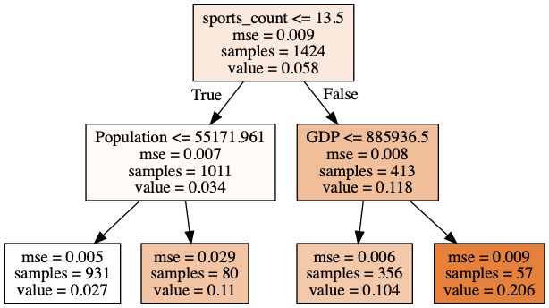
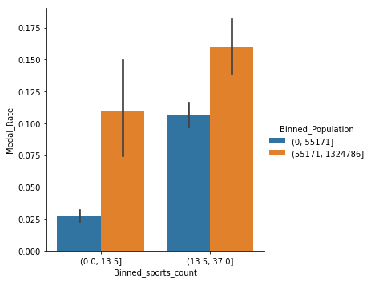
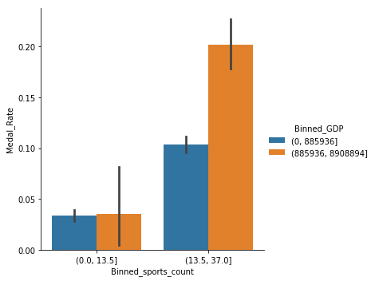
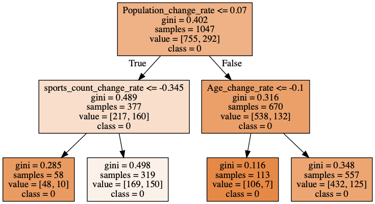
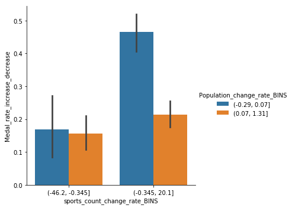
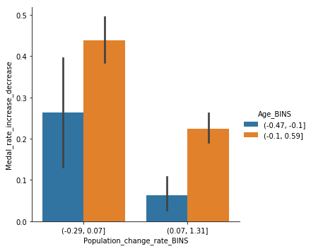

```python
import pandas as pd
import numpy as np
import seaborn as sns
%pylab inline

import sklearn as sk
import sklearn.tree as tree
from IPython.display import Image  
import pydotplus

import warnings
warnings.filterwarnings('ignore')
```

    Populating the interactive namespace from numpy and matplotlib


### This project is to predict countries’ medal rate by consolidating historical events data over 120 years and countries’ economic and demographic data

 Import and clean GDP data（  http://www.ggdc.net/maddison/historical_statistics/horizontal-file_02-2010.xls     ）


```python
gdp=pd.read_excel('GDP.xls')
cols=gdp.columns.to_list()
cols[0]='Year'
gdp.columns=cols
gdp.set_index('Year',inplace=True)
gdp.head(2)
```


<div>
<style scoped>
    .dataframe tbody tr th:only-of-type {
        vertical-align: middle;
    }

    .dataframe tbody tr th {
        vertical-align: top;
    }

    .dataframe thead th {
        text-align: right;
    }
</style>
<table border="1" class="dataframe">
  <thead>
    <tr style="text-align: right;">
      <th></th>
      <th>Austria</th>
      <th>Belgium</th>
      <th>Denmark</th>
      <th>Finland</th>
      <th>France</th>
      <th>Germany</th>
      <th>Italy</th>
      <th>Netherlands</th>
      <th>Norway</th>
      <th>Sweden</th>
      <th>...</th>
      <th>Tanzania</th>
      <th>Togo</th>
      <th>Tunisia</th>
      <th>Uganda</th>
      <th>Zaire (Congo Kinshasa)</th>
      <th>Zambia</th>
      <th>Zimbabwe</th>
      <th>Total 3 Small African countries</th>
      <th>Unnamed: 173</th>
      <th>Unnamed: 174</th>
    </tr>
    <tr>
      <th>Year</th>
      <th></th>
      <th></th>
      <th></th>
      <th></th>
      <th></th>
      <th></th>
      <th></th>
      <th></th>
      <th></th>
      <th></th>
      <th></th>
      <th></th>
      <th></th>
      <th></th>
      <th></th>
      <th></th>
      <th></th>
      <th></th>
      <th></th>
      <th></th>
      <th></th>
    </tr>
  </thead>
  <tbody>
    <tr>
      <th>1949</th>
      <td>22864.725</td>
      <td>44735.901</td>
      <td>27471.18</td>
      <td>16419.73</td>
      <td>205174.38</td>
      <td>223178.0</td>
      <td>152563.109094</td>
      <td>58546.0</td>
      <td>16904.757947</td>
      <td>45694</td>
      <td>...</td>
      <td>NaN</td>
      <td>NaN</td>
      <td>NaN</td>
      <td>NaN</td>
      <td>NaN</td>
      <td>NaN</td>
      <td>NaN</td>
      <td>NaN</td>
      <td>NaN</td>
      <td>NaN</td>
    </tr>
    <tr>
      <th>1950</th>
      <td>25702.000</td>
      <td>47190.000</td>
      <td>29654.00</td>
      <td>17051.00</td>
      <td>220492.00</td>
      <td>265354.0</td>
      <td>164957.000000</td>
      <td>60642.0</td>
      <td>17728.034377</td>
      <td>47478</td>
      <td>...</td>
      <td>3362.135922</td>
      <td>672.661871</td>
      <td>3920.26911</td>
      <td>3792.64214</td>
      <td>7730.694606</td>
      <td>1687.303253</td>
      <td>2000.0</td>
      <td>27.0</td>
      <td>NaN</td>
      <td>NaN</td>
    </tr>
  </tbody>
</table>
<p>2 rows × 174 columns</p>
</div>


 Create GDP columns


```python
gdp_clean=gdp.copy()
gdp_clean=gdp_clean.stack().to_frame()
gdp_clean.reset_index(inplace=True)
gdp_clean.columns=['Year','Country','GDP']
gdp_clean.Country=gdp_clean.Country.str.lower()
gdp_clean.head(2)
```


<div>
<style scoped>
    .dataframe tbody tr th:only-of-type {
        vertical-align: middle;
    }

    .dataframe tbody tr th {
        vertical-align: top;
    }

    .dataframe thead th {
        text-align: right;
    }
</style>
<table border="1" class="dataframe">
  <thead>
    <tr style="text-align: right;">
      <th></th>
      <th>Year</th>
      <th>Country</th>
      <th>GDP</th>
    </tr>
  </thead>
  <tbody>
    <tr>
      <th>0</th>
      <td>1949</td>
      <td>austria</td>
      <td>22864.725</td>
    </tr>
    <tr>
      <th>1</th>
      <td>1949</td>
      <td>belgium</td>
      <td>44735.901</td>
    </tr>
  </tbody>
</table>
</div>


Caculate GDP growth rate


```python
gdp_clean['GDP_shift']=gdp_clean.groupby('Country').GDP.shift(1)
gdp_clean['GDP_Growth_Rate']=100*(gdp_clean.GDP-gdp_clean.GDP_shift)/gdp_clean.GDP_shift
gdp_clean.head(2)
```


<div>
<style scoped>
    .dataframe tbody tr th:only-of-type {
        vertical-align: middle;
    }

    .dataframe tbody tr th {
        vertical-align: top;
    }

    .dataframe thead th {
        text-align: right;
    }
</style>
<table border="1" class="dataframe">
  <thead>
    <tr style="text-align: right;">
      <th></th>
      <th>Year</th>
      <th>Country</th>
      <th>GDP</th>
      <th>GDP_shift</th>
      <th>GDP_Growth_Rate</th>
    </tr>
  </thead>
  <tbody>
    <tr>
      <th>0</th>
      <td>1949</td>
      <td>austria</td>
      <td>22864.725</td>
      <td>NaN</td>
      <td>NaN</td>
    </tr>
    <tr>
      <th>1</th>
      <td>1949</td>
      <td>belgium</td>
      <td>44735.901</td>
      <td>NaN</td>
      <td>NaN</td>
    </tr>
  </tbody>
</table>
</div>


 Import and clean population data （  http://www.ggdc.net/maddison/historical_statistics/horizontal-file_02-2010.xls     ）


```python
popu1=pd.read_csv("POPU.csv")
popu1.head(2)
```


<div>
<style scoped>
    .dataframe tbody tr th:only-of-type {
        vertical-align: middle;
    }

    .dataframe tbody tr th {
        vertical-align: top;
    }

    .dataframe thead th {
        text-align: right;
    }
</style>
<table border="1" class="dataframe">
  <thead>
    <tr style="text-align: right;">
      <th></th>
      <th>Unnamed: 0</th>
      <th>1952</th>
      <th>1956</th>
      <th>1960</th>
      <th>1964</th>
      <th>1968</th>
      <th>1972</th>
      <th>1976</th>
      <th>1980</th>
      <th>1984</th>
      <th>1988</th>
      <th>1992</th>
      <th>1996</th>
      <th>2000</th>
      <th>2004</th>
      <th>2008</th>
    </tr>
  </thead>
  <tbody>
    <tr>
      <th>0</th>
      <td>Austria</td>
      <td>6927.772</td>
      <td>6952.359</td>
      <td>7047.437</td>
      <td>7223.801</td>
      <td>7415.403</td>
      <td>7544.201</td>
      <td>7565.525</td>
      <td>7549.433</td>
      <td>7554.132</td>
      <td>7599.791</td>
      <td>7914.969</td>
      <td>8060.852</td>
      <td>8113.413</td>
      <td>8174.762</td>
      <td>8205.533</td>
    </tr>
    <tr>
      <th>1</th>
      <td>Belgium</td>
      <td>8730.405</td>
      <td>8923.845</td>
      <td>9118.700</td>
      <td>9367.000</td>
      <td>9589.800</td>
      <td>9709.100</td>
      <td>9811.000</td>
      <td>9846.800</td>
      <td>9855.300</td>
      <td>9884.000</td>
      <td>10045.622</td>
      <td>10178.934</td>
      <td>10263.618</td>
      <td>10348.276</td>
      <td>10403.951</td>
    </tr>
  </tbody>
</table>
</div>


```python
popu=popu1.copy()
b=popu.columns.to_list()
b[0]='country'
popu.columns=b
popu.head()
popu.set_index('country',inplace=True)
popu=popu.stack().to_frame()
popu.reset_index(inplace=True)
popu.columns=['Country','Year',"Population"]
popu.Country=popu.Country.str.lower()
popu_clean=popu
popu_clean.head(2)
```


<div>
<style scoped>
    .dataframe tbody tr th:only-of-type {
        vertical-align: middle;
    }

    .dataframe tbody tr th {
        vertical-align: top;
    }

    .dataframe thead th {
        text-align: right;
    }
</style>
<table border="1" class="dataframe">
  <thead>
    <tr style="text-align: right;">
      <th></th>
      <th>Country</th>
      <th>Year</th>
      <th>Population</th>
    </tr>
  </thead>
  <tbody>
    <tr>
      <th>0</th>
      <td>austria</td>
      <td>1952</td>
      <td>6927.772</td>
    </tr>
    <tr>
      <th>1</th>
      <td>austria</td>
      <td>1956</td>
      <td>6952.359</td>
    </tr>
  </tbody>
</table>
</div>


  Import country dictionary data （source: https://www.kaggle.com/heesoo37/120-years-of-olympic-history-athletes-and-results)


```python
country_df=pd.read_excel('noc.xls')
country_df.columns=['NOC','region']
country_df.region=cd.region.str.lower()
country_df.head(2)
```


<div>
<style scoped>
    .dataframe tbody tr th:only-of-type {
        vertical-align: middle;
    }

    .dataframe tbody tr th {
        vertical-align: top;
    }

    .dataframe thead th {
        text-align: right;
    }
</style>
<table border="1" class="dataframe">
  <thead>
    <tr style="text-align: right;">
      <th></th>
      <th>NOC</th>
      <th>region</th>
    </tr>
  </thead>
  <tbody>
    <tr>
      <th>0</th>
      <td>AFG</td>
      <td>afghanistan</td>
    </tr>
    <tr>
      <th>1</th>
      <td>ALB</td>
      <td>albania</td>
    </tr>
  </tbody>
</table>
</div>


 Import and clean Athlete_events data(120 years of Olympic history: athletes and results, source: https://www.kaggle.com/heesoo37/120-years-of-olympic-history-athletes-and-results)


```python
athlete_events=pd.read_csv('athlete_events.csv')
```

 Set consistent NOC for regions that changed names


```python
country_noc_map = {
    "TCH":"CZE",
    "FRG": "GER",
    "GDR": "GER",
    "MAL": "MAS",
    "NBO": "MAS",
    "EUN": "RUS",
    "URS": "RUS",
    "SCG": "SRB",
    "YUG": "SRB",
    "UAR": "SYR",
    "WIF": "TTO",
    "VNM": "VIE",
    "RHO": "ZIM",
    "YMD": "TEM",
    "YAR": "YEM",
    }
```


```python
for k,v in country_noc_map.items():
    athlete_events.loc[athlete_events["NOC"] == k, "NOC"] = v
```


```python
athlete_events.head(5)
```


<div>
<style scoped>
    .dataframe tbody tr th:only-of-type {
        vertical-align: middle;
    }

    .dataframe tbody tr th {
        vertical-align: top;
    }

    .dataframe thead th {
        text-align: right;
    }
</style>
<table border="1" class="dataframe">
  <thead>
    <tr style="text-align: right;">
      <th></th>
      <th>ID</th>
      <th>Name</th>
      <th>Sex</th>
      <th>Age</th>
      <th>Height</th>
      <th>Weight</th>
      <th>Team</th>
      <th>NOC</th>
      <th>Games</th>
      <th>Year</th>
      <th>Season</th>
      <th>City</th>
      <th>Sport</th>
      <th>Event</th>
      <th>Medal</th>
    </tr>
  </thead>
  <tbody>
    <tr>
      <th>0</th>
      <td>1</td>
      <td>A Dijiang</td>
      <td>M</td>
      <td>24.0</td>
      <td>180.0</td>
      <td>80.0</td>
      <td>China</td>
      <td>CHN</td>
      <td>1992 Summer</td>
      <td>1992</td>
      <td>Summer</td>
      <td>Barcelona</td>
      <td>Basketball</td>
      <td>Basketball Men's Basketball</td>
      <td>NaN</td>
    </tr>
    <tr>
      <th>1</th>
      <td>2</td>
      <td>A Lamusi</td>
      <td>M</td>
      <td>23.0</td>
      <td>170.0</td>
      <td>60.0</td>
      <td>China</td>
      <td>CHN</td>
      <td>2012 Summer</td>
      <td>2012</td>
      <td>Summer</td>
      <td>London</td>
      <td>Judo</td>
      <td>Judo Men's Extra-Lightweight</td>
      <td>NaN</td>
    </tr>
    <tr>
      <th>2</th>
      <td>3</td>
      <td>Gunnar Nielsen Aaby</td>
      <td>M</td>
      <td>24.0</td>
      <td>NaN</td>
      <td>NaN</td>
      <td>Denmark</td>
      <td>DEN</td>
      <td>1920 Summer</td>
      <td>1920</td>
      <td>Summer</td>
      <td>Antwerpen</td>
      <td>Football</td>
      <td>Football Men's Football</td>
      <td>NaN</td>
    </tr>
    <tr>
      <th>3</th>
      <td>4</td>
      <td>Edgar Lindenau Aabye</td>
      <td>M</td>
      <td>34.0</td>
      <td>NaN</td>
      <td>NaN</td>
      <td>Denmark/Sweden</td>
      <td>DEN</td>
      <td>1900 Summer</td>
      <td>1900</td>
      <td>Summer</td>
      <td>Paris</td>
      <td>Tug-Of-War</td>
      <td>Tug-Of-War Men's Tug-Of-War</td>
      <td>Gold</td>
    </tr>
    <tr>
      <th>4</th>
      <td>5</td>
      <td>Christine Jacoba Aaftink</td>
      <td>F</td>
      <td>21.0</td>
      <td>185.0</td>
      <td>82.0</td>
      <td>Netherlands</td>
      <td>NED</td>
      <td>1988 Winter</td>
      <td>1988</td>
      <td>Winter</td>
      <td>Calgary</td>
      <td>Speed Skating</td>
      <td>Speed Skating Women's 500 metres</td>
      <td>NaN</td>
    </tr>
  </tbody>
</table>
</div>


Create new column Medal_Rate, 1 for row contains gold, bronze or  silver, 0 for NaN


```python
athlete_events["Medal_Rate"]=~athlete_events.Medal.isna()*1
```

 Create new column Females, 1 for female and 0 for male


```python
athlete_events["Female"]=(athlete_events.Sex=='F')*1
```

 Drop all irrelevant features


```python
athlete_events.drop(["ID","Name","City",'Games','Medal','Event'],axis=1, inplace=True)
```


```python
athlete_events.head(2)
```


<div>
<style scoped>
    .dataframe tbody tr th:only-of-type {
        vertical-align: middle;
    }

    .dataframe tbody tr th {
        vertical-align: top;
    }

    .dataframe thead th {
        text-align: right;
    }
</style>
<table border="1" class="dataframe">
  <thead>
    <tr style="text-align: right;">
      <th></th>
      <th>Sex</th>
      <th>Age</th>
      <th>Height</th>
      <th>Weight</th>
      <th>Team</th>
      <th>NOC</th>
      <th>Year</th>
      <th>Season</th>
      <th>Sport</th>
      <th>Medal_Rate</th>
      <th>Female</th>
    </tr>
  </thead>
  <tbody>
    <tr>
      <th>0</th>
      <td>M</td>
      <td>24.0</td>
      <td>180.0</td>
      <td>80.0</td>
      <td>China</td>
      <td>CHN</td>
      <td>1992</td>
      <td>Summer</td>
      <td>Basketball</td>
      <td>0</td>
      <td>0</td>
    </tr>
    <tr>
      <th>1</th>
      <td>M</td>
      <td>23.0</td>
      <td>170.0</td>
      <td>60.0</td>
      <td>China</td>
      <td>CHN</td>
      <td>2012</td>
      <td>Summer</td>
      <td>Judo</td>
      <td>0</td>
      <td>0</td>
    </tr>
  </tbody>
</table>
</div>


 Create dataframe df1 whose row represents each year, every country's athelets' average age, Height, Weight, Medal rate and Female ratio


```python
athlete_events_grouped=athlete_events.groupby(['NOC','Year'],as_index=False).mean()
```


```python
athlete_events_grouped.head(2)
```


<div>
<style scoped>
    .dataframe tbody tr th:only-of-type {
        vertical-align: middle;
    }

    .dataframe tbody tr th {
        vertical-align: top;
    }

    .dataframe thead th {
        text-align: right;
    }
</style>
<table border="1" class="dataframe">
  <thead>
    <tr style="text-align: right;">
      <th></th>
      <th>NOC</th>
      <th>Year</th>
      <th>Age</th>
      <th>Height</th>
      <th>Weight</th>
      <th>Medal_Rate</th>
      <th>Female</th>
    </tr>
  </thead>
  <tbody>
    <tr>
      <th>0</th>
      <td>AFG</td>
      <td>1936</td>
      <td>24.266667</td>
      <td>NaN</td>
      <td>NaN</td>
      <td>0.0</td>
      <td>0.0</td>
    </tr>
    <tr>
      <th>1</th>
      <td>AFG</td>
      <td>1948</td>
      <td>NaN</td>
      <td>NaN</td>
      <td>NaN</td>
      <td>0.0</td>
      <td>0.0</td>
    </tr>
  </tbody>
</table>
</div>


 Create new feature as previous medal rate


```python
athlete_events_grouped['Previous_Medal_Rate']=athlete_events_grouped.groupby('NOC').Medal_Rate.shift(1)
```

Create new feature indicating whether medal rate increase(1) or decrease(0) comparing with previous event's medal_rate


```python
athlete_events_grouped['Medal_rate_increase_decrease']=((athlete_events_grouped.Medal_Rate-df1.Previous_Medal_Rate)>0)*1
```

 Create new feature indicating the number of unique sports each country attended


```python
athlete_events_grouped['sports_count']=(athlete_events.groupby(['NOC','Year'],as_index=False)).Sport.nunique()
```

 Merge country dictionary and grouped athelete events 


```python
athlete_events_merge = pd.merge(athlete_events_grouped,cd,  how='left', left_on=['NOC'], right_on = ["NOC"])
```

 Merge athlete_events_grouped and gpd_clean data


```python
athlete_events_gpd=pd.merge(athlete_events_merge,gdp_clean,how='left', \
                            left_on=['region','Year'], right_on = ['Country','Year'])
```


```python
athlete_events_gpd.head(2)
```


<div>
<style scoped>
    .dataframe tbody tr th:only-of-type {
        vertical-align: middle;
    }

    .dataframe tbody tr th {
        vertical-align: top;
    }

    .dataframe thead th {
        text-align: right;
    }
</style>
<table border="1" class="dataframe">
  <thead>
    <tr style="text-align: right;">
      <th></th>
      <th>NOC</th>
      <th>Year</th>
      <th>Age</th>
      <th>Height</th>
      <th>Weight</th>
      <th>Medal_Rate</th>
      <th>Female</th>
      <th>Previous_Medal_Rate</th>
      <th>Medal_rate_increase_decrease</th>
      <th>sports_count</th>
      <th>region</th>
      <th>Country</th>
      <th>GDP</th>
      <th>GDP_shift</th>
      <th>GDP_Growth_Rate</th>
    </tr>
  </thead>
  <tbody>
    <tr>
      <th>0</th>
      <td>AFG</td>
      <td>1936</td>
      <td>24.266667</td>
      <td>NaN</td>
      <td>NaN</td>
      <td>0.0</td>
      <td>0.0</td>
      <td>NaN</td>
      <td>0</td>
      <td>2</td>
      <td>afghanistan</td>
      <td>NaN</td>
      <td>NaN</td>
      <td>NaN</td>
      <td>NaN</td>
    </tr>
    <tr>
      <th>1</th>
      <td>AFG</td>
      <td>1948</td>
      <td>NaN</td>
      <td>NaN</td>
      <td>NaN</td>
      <td>0.0</td>
      <td>0.0</td>
      <td>0.0</td>
      <td>0</td>
      <td>2</td>
      <td>afghanistan</td>
      <td>NaN</td>
      <td>NaN</td>
      <td>NaN</td>
      <td>NaN</td>
    </tr>
  </tbody>
</table>
</div>


Merge athlete_events_gpd and population 


```python
popu_clean['Year']=popu_clean.Year.astype('int')
```


```python
athlete_events_gpd_popu = pd.merge(athlete_events_gpd,popu_clean,\
                                   how='left', left_on=['region','Year'], right_on = ['Country','Year'])
athlete_events_gpd_popu.head(2)
```


<div>
<style scoped>
    .dataframe tbody tr th:only-of-type {
        vertical-align: middle;
    }

    .dataframe tbody tr th {
        vertical-align: top;
    }

    .dataframe thead th {
        text-align: right;
    }
</style>
<table border="1" class="dataframe">
  <thead>
    <tr style="text-align: right;">
      <th></th>
      <th>NOC</th>
      <th>Year</th>
      <th>Age</th>
      <th>Height</th>
      <th>Weight</th>
      <th>Medal_Rate</th>
      <th>Female</th>
      <th>Previous_Medal_Rate</th>
      <th>Medal_rate_increase_decrease</th>
      <th>sports_count</th>
      <th>region</th>
      <th>Country_x</th>
      <th>GDP</th>
      <th>GDP_shift</th>
      <th>GDP_Growth_Rate</th>
      <th>Country_y</th>
      <th>Population</th>
    </tr>
  </thead>
  <tbody>
    <tr>
      <th>0</th>
      <td>AFG</td>
      <td>1936</td>
      <td>24.266667</td>
      <td>NaN</td>
      <td>NaN</td>
      <td>0.0</td>
      <td>0.0</td>
      <td>NaN</td>
      <td>0</td>
      <td>2</td>
      <td>afghanistan</td>
      <td>NaN</td>
      <td>NaN</td>
      <td>NaN</td>
      <td>NaN</td>
      <td>NaN</td>
      <td>NaN</td>
    </tr>
    <tr>
      <th>1</th>
      <td>AFG</td>
      <td>1948</td>
      <td>NaN</td>
      <td>NaN</td>
      <td>NaN</td>
      <td>0.0</td>
      <td>0.0</td>
      <td>0.0</td>
      <td>0</td>
      <td>2</td>
      <td>afghanistan</td>
      <td>NaN</td>
      <td>NaN</td>
      <td>NaN</td>
      <td>NaN</td>
      <td>NaN</td>
      <td>NaN</td>
    </tr>
  </tbody>
</table>
</div>


 Drop NOC, Country_x,Country_y columns


```python
athlete_events_gpd_popu.drop(['NOC','Country_x','Country_y'],axis=1,inplace=True)
```

### First decision tree:  Features influencing the medal rate


```python
tree_data=athlete_events_gpd_popu.copy()
```


```python
tree_data.drop(['Medal_rate_increase_decrease','GDP_shift','Previous_Medal_Rate',"GDP_Growth_Rate",'region','Year'],axis=1,inplace=True)
tree_data.dropna(inplace=True)
X = tree_data.drop(columns=['Medal_Rate'], axis=1)
Y=tree_data.Medal_Rate
model = tree.DecisionTreeRegressor(max_depth = 2)
model.fit(X,Y)
```


    DecisionTreeRegressor(criterion='mse', max_depth=2, max_features=None,
               max_leaf_nodes=None, min_impurity_decrease=0.0,
               min_impurity_split=None, min_samples_leaf=1,
               min_samples_split=2, min_weight_fraction_leaf=0.0,
               presort=False, random_state=None, splitter='best')


```python
# This code will visualize a decision tree dt, trained with the attributes in X and the class labels in Y
model_feature_names = list(X.columns)
model_target_names = np.array(Y.unique(),dtype=np.str) 
tree.export_graphviz(model, out_file='tree.dot', 
    feature_names=model_feature_names, class_names=model_target_names,
    filled=True)  
graph = pydotplus.graph_from_dot_file('tree.dot')
Image(graph.create_png())
```





#### Validating the finding with seaborn


```python
tree_data['Binned_sports_count'] = pd.cut(tree_data['sports_count'],
        bins=[0,13.5,37])
```


```python
tree_data['Binned_GDP'] = pd.cut(tree_data['GDP'],
        bins=[0,885936,8908894])
```


```python
tree_data['Binned_Population'] = pd.cut(tree_data["Population"],
        bins=[0,55171,1324786])
```

 The medal rate for countries with large populations are significantly higher than small population countires(less than 55171000), especially when  the number of sport categories is less than 13.5.


```python
sns.catplot(data=tree_data,y='Medal_Rate',hue='Binned_Population',x='Binned_sports_count',kind='bar',ci=95)
```


    <seaborn.axisgrid.FacetGrid at 0x1a25634f28>





When the sports catergories is over 13.5 , the medal rate for countries with higher GDP is significantly higher than countries with lower GDP. However, when number of sports is less than 13.5, GDP has no impact on medal rate.


```python
sns.catplot(data=tree_data,y='Medal_Rate',hue='Binned_GDP',x='Binned_sports_count',kind='bar')
```


    <seaborn.axisgrid.FacetGrid at 0x1a25fc57b8>





### Second decision tree: features that correlate with the trending of medal rate


```python
columns=['Age', 'Height', 'Weight', 'Female',
       'sports_count', 'Population']
```

Create change rate for  ['Age', 'Height', 'Weight', 'Female', 'sports_count', 'Population']  columns


```python
for i in columns:

    athlete_events_gpd_popu[i+"_change_rate"]=(athlete_events_gpd_popu[i]-athlete_events_gpd_popu.groupby(['region'])[i].shift(1))\
    /((athlete_events_gpd_popu.groupby(['region'])[i].shift(1))+e-4)
```


```python
tree_data2=athlete_events_gpd_popu.copy()
```


```python
tree_data2.head(2)
```


<div>
<style scoped>
    .dataframe tbody tr th:only-of-type {
        vertical-align: middle;
    }

    .dataframe tbody tr th {
        vertical-align: top;
    }

    .dataframe thead th {
        text-align: right;
    }
</style>
<table border="1" class="dataframe">
  <thead>
    <tr style="text-align: right;">
      <th></th>
      <th>Year</th>
      <th>Age</th>
      <th>Height</th>
      <th>Weight</th>
      <th>Medal_Rate</th>
      <th>Female</th>
      <th>Previous_Medal_Rate</th>
      <th>Medal_rate_increase_decrease</th>
      <th>sports_count</th>
      <th>region</th>
      <th>GDP</th>
      <th>GDP_shift</th>
      <th>GDP_Growth_Rate</th>
      <th>Population</th>
      <th>Age_change_rate</th>
      <th>Height_change_rate</th>
      <th>Weight_change_rate</th>
      <th>Female_change_rate</th>
      <th>sports_count_change_rate</th>
      <th>Population_change_rate</th>
    </tr>
  </thead>
  <tbody>
    <tr>
      <th>0</th>
      <td>1936</td>
      <td>24.266667</td>
      <td>NaN</td>
      <td>NaN</td>
      <td>0.0</td>
      <td>0.0</td>
      <td>NaN</td>
      <td>0</td>
      <td>2</td>
      <td>afghanistan</td>
      <td>NaN</td>
      <td>NaN</td>
      <td>NaN</td>
      <td>NaN</td>
      <td>NaN</td>
      <td>NaN</td>
      <td>NaN</td>
      <td>NaN</td>
      <td>NaN</td>
      <td>NaN</td>
    </tr>
    <tr>
      <th>1</th>
      <td>1948</td>
      <td>NaN</td>
      <td>NaN</td>
      <td>NaN</td>
      <td>0.0</td>
      <td>0.0</td>
      <td>0.0</td>
      <td>0</td>
      <td>2</td>
      <td>afghanistan</td>
      <td>NaN</td>
      <td>NaN</td>
      <td>NaN</td>
      <td>NaN</td>
      <td>NaN</td>
      <td>NaN</td>
      <td>NaN</td>
      <td>-0.0</td>
      <td>0.0</td>
      <td>NaN</td>
    </tr>
  </tbody>
</table>
</div>


```python
tree_data2.drop(['Age', 'Height', 'Weight', 'Female', 'sports_count', 'Population',\
          'Medal_Rate','GDP_shift','GDP','Previous_Medal_Rate','Year','region'],axis=1,inplace=True)
```


```python
tree_data2.dropna(inplace=True)
```


```python
tree_data2.head(2)
```


<div>
<style scoped>
    .dataframe tbody tr th:only-of-type {
        vertical-align: middle;
    }

    .dataframe tbody tr th {
        vertical-align: top;
    }

    .dataframe thead th {
        text-align: right;
    }
</style>
<table border="1" class="dataframe">
  <thead>
    <tr style="text-align: right;">
      <th></th>
      <th>Medal_rate_increase_decrease</th>
      <th>GDP_Growth_Rate</th>
      <th>Age_change_rate</th>
      <th>Height_change_rate</th>
      <th>Weight_change_rate</th>
      <th>Female_change_rate</th>
      <th>sports_count_change_rate</th>
      <th>Population_change_rate</th>
    </tr>
  </thead>
  <tbody>
    <tr>
      <th>4</th>
      <td>0</td>
      <td>1.935739</td>
      <td>-0.059576</td>
      <td>-0.057185</td>
      <td>-0.076112</td>
      <td>-0.0</td>
      <td>-1.392211</td>
      <td>0.093071</td>
    </tr>
    <tr>
      <th>5</th>
      <td>0</td>
      <td>3.579255</td>
      <td>0.057920</td>
      <td>0.057601</td>
      <td>0.091316</td>
      <td>-0.0</td>
      <td>-0.000000</td>
      <td>0.100639</td>
    </tr>
  </tbody>
</table>
</div>


```python
X = tree_data2.drop(columns=['Medal_rate_increase_decrease'], axis=1) 
```


```python
Y=tree_data2.Medal_rate_increase_decrease
```


```python
dt = tree.DecisionTreeClassifier(max_depth = 2)
```


```python
dt.fit(X,Y)
```


    DecisionTreeClassifier(class_weight=None, criterion='gini', max_depth=2,
                max_features=None, max_leaf_nodes=None,
                min_impurity_decrease=0.0, min_impurity_split=None,
                min_samples_leaf=1, min_samples_split=2,
                min_weight_fraction_leaf=0.0, presort=False, random_state=None,
                splitter='best')


```python
dt_feature_names = list(X.columns)
dt_target_names = np.array(Y.unique(),dtype=np.str) 
tree.export_graphviz(dt, out_file='tree.dot', 
    feature_names=dt_feature_names, class_names=dt_target_names,
    filled=True)  
graph = pydotplus.graph_from_dot_file('tree.dot')
Image(graph.create_png())
```





```python
tree_data2['Population_change_rate_BINS'] = pd.cut(tree_data2['Population_change_rate'],
        bins=[-0.29,0.07,1.31])
```


```python
tree_data2['sports_count_change_rate_BINS'] = pd.cut(tree_data2['sports_count_change_rate'],
        bins=[-46.2,-0.345,20.1])
```


```python
tree_data2['Age_BINS']=pd.cut(tree_data2['Age_change_rate'],bins=[-0.47,-0.1,0.59])
```

When the number of sports decreased over 34.5%, the population change doesn't influence the increase or decrease of medal rate, however, when the sports decrease is less than 34.5%, nations with less than 7% increase in population has a significanlty higher increase medal rate 


```python
sns.catplot(data=tree_data2,y='Medal_rate_increase_decrease',hue='Population_change_rate_BINS',\
            x='sports_count_change_rate_BINS',kind='bar',ci=95)
```


    <seaborn.axisgrid.FacetGrid at 0x1a23a38208>





For countries with less than 7% increase in population, age change of athletes doesn't influence the change in medal rate, when the population increase is over than 7%, nations with less than 10% decrease in athelets' age  is significantly higher in medal rate than countries with more than 10% decrease in athelets'age


```python
sns.catplot(data=tree_data2,y='Medal_rate_increase_decrease',x='Population_change_rate_BINS',\
            hue='Age_BINS',kind='bar',ci=95)
```


    <seaborn.axisgrid.FacetGrid at 0x1a2de756a0>




