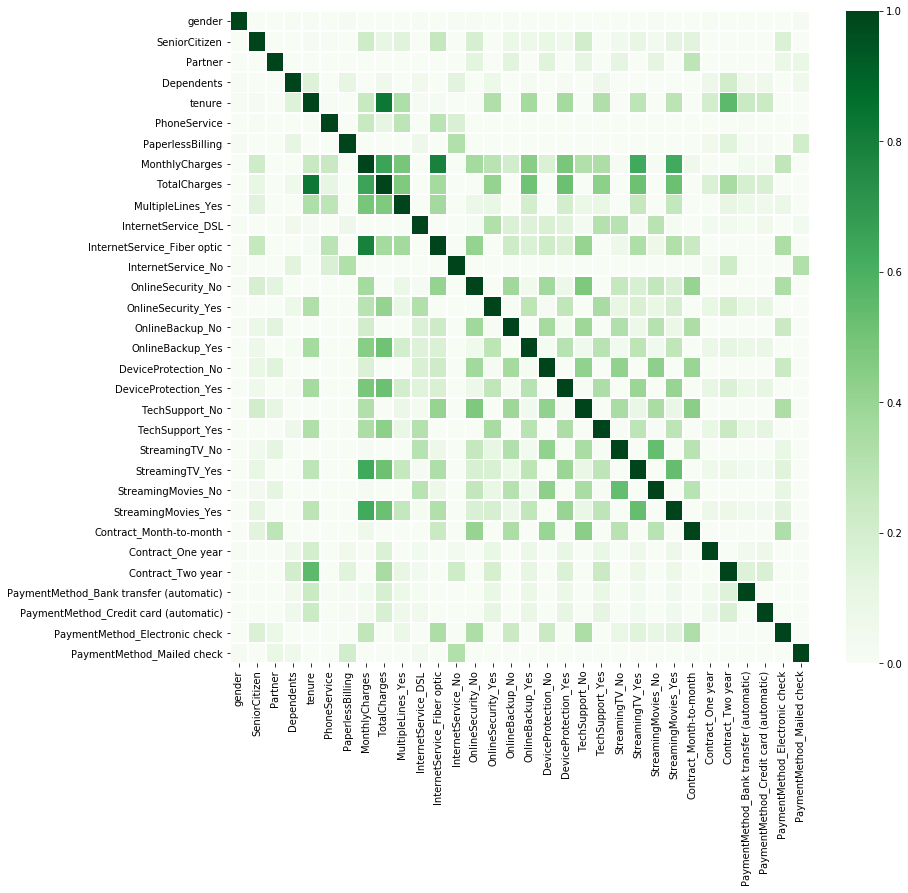
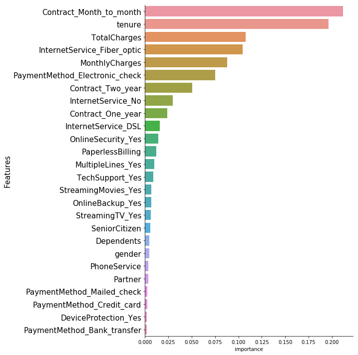
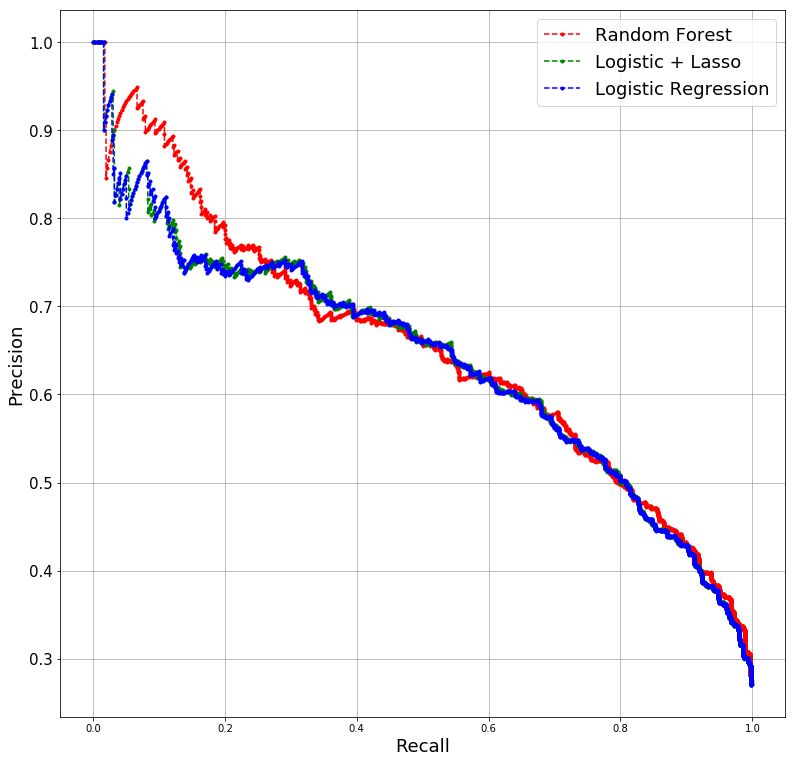

### Telecom customer churn predication


```python
import pandas as pd
import numpy as np
import seaborn as sns
%pylab inline

import sklearn as sk
import sklearn.tree as tree
from IPython.display import Image  
import pydotplus

import sklearn as sk


import warnings
warnings.filterwarnings('ignore')# ignore warnings
```

    Populating the interactive namespace from numpy and matplotlib


data cleanning ( data source: https://www.kaggle.com/blastchar/telco-customer-churn )


```python
telecom_customer=pd.read_csv("Telco-Customer-Churn.csv")
```


```python
telecom_customer.head(5).T
```


<div>
<style scoped>
    .dataframe tbody tr th:only-of-type {
        vertical-align: middle;
    }

    .dataframe tbody tr th {
        vertical-align: top;
    }

    .dataframe thead th {
        text-align: right;
    }
</style>
<table border="1" class="dataframe">
  <thead>
    <tr style="text-align: right;">
      <th></th>
      <th>0</th>
      <th>1</th>
      <th>2</th>
      <th>3</th>
      <th>4</th>
    </tr>
  </thead>
  <tbody>
    <tr>
      <th>customerID</th>
      <td>7590-VHVEG</td>
      <td>5575-GNVDE</td>
      <td>3668-QPYBK</td>
      <td>7795-CFOCW</td>
      <td>9237-HQITU</td>
    </tr>
    <tr>
      <th>gender</th>
      <td>Female</td>
      <td>Male</td>
      <td>Male</td>
      <td>Male</td>
      <td>Female</td>
    </tr>
    <tr>
      <th>SeniorCitizen</th>
      <td>0</td>
      <td>0</td>
      <td>0</td>
      <td>0</td>
      <td>0</td>
    </tr>
    <tr>
      <th>Partner</th>
      <td>Yes</td>
      <td>No</td>
      <td>No</td>
      <td>No</td>
      <td>No</td>
    </tr>
    <tr>
      <th>Dependents</th>
      <td>No</td>
      <td>No</td>
      <td>No</td>
      <td>No</td>
      <td>No</td>
    </tr>
    <tr>
      <th>tenure</th>
      <td>1</td>
      <td>34</td>
      <td>2</td>
      <td>45</td>
      <td>2</td>
    </tr>
    <tr>
      <th>PhoneService</th>
      <td>No</td>
      <td>Yes</td>
      <td>Yes</td>
      <td>No</td>
      <td>Yes</td>
    </tr>
    <tr>
      <th>MultipleLines</th>
      <td>No phone service</td>
      <td>No</td>
      <td>No</td>
      <td>No phone service</td>
      <td>No</td>
    </tr>
    <tr>
      <th>InternetService</th>
      <td>DSL</td>
      <td>DSL</td>
      <td>DSL</td>
      <td>DSL</td>
      <td>Fiber optic</td>
    </tr>
    <tr>
      <th>OnlineSecurity</th>
      <td>No</td>
      <td>Yes</td>
      <td>Yes</td>
      <td>Yes</td>
      <td>No</td>
    </tr>
    <tr>
      <th>OnlineBackup</th>
      <td>Yes</td>
      <td>No</td>
      <td>Yes</td>
      <td>No</td>
      <td>No</td>
    </tr>
    <tr>
      <th>DeviceProtection</th>
      <td>No</td>
      <td>Yes</td>
      <td>No</td>
      <td>Yes</td>
      <td>No</td>
    </tr>
    <tr>
      <th>TechSupport</th>
      <td>No</td>
      <td>No</td>
      <td>No</td>
      <td>Yes</td>
      <td>No</td>
    </tr>
    <tr>
      <th>StreamingTV</th>
      <td>No</td>
      <td>No</td>
      <td>No</td>
      <td>No</td>
      <td>No</td>
    </tr>
    <tr>
      <th>StreamingMovies</th>
      <td>No</td>
      <td>No</td>
      <td>No</td>
      <td>No</td>
      <td>No</td>
    </tr>
    <tr>
      <th>Contract</th>
      <td>Month-to-month</td>
      <td>One year</td>
      <td>Month-to-month</td>
      <td>One year</td>
      <td>Month-to-month</td>
    </tr>
    <tr>
      <th>PaperlessBilling</th>
      <td>Yes</td>
      <td>No</td>
      <td>Yes</td>
      <td>No</td>
      <td>Yes</td>
    </tr>
    <tr>
      <th>PaymentMethod</th>
      <td>Electronic check</td>
      <td>Mailed check</td>
      <td>Mailed check</td>
      <td>Bank transfer (automatic)</td>
      <td>Electronic check</td>
    </tr>
    <tr>
      <th>MonthlyCharges</th>
      <td>29.85</td>
      <td>56.95</td>
      <td>53.85</td>
      <td>42.3</td>
      <td>70.7</td>
    </tr>
    <tr>
      <th>TotalCharges</th>
      <td>29.85</td>
      <td>1889.5</td>
      <td>108.15</td>
      <td>1840.75</td>
      <td>151.65</td>
    </tr>
    <tr>
      <th>Churn</th>
      <td>No</td>
      <td>No</td>
      <td>Yes</td>
      <td>No</td>
      <td>Yes</td>
    </tr>
  </tbody>
</table>
</div>


```python
telecom_customer.drop(columns=['customerID'],inplace=True)
```


```python
telecom_customer.TotalCharges.replace({" ": "0"},inplace=True)
```


```python
telecom_customer.TotalCharges=telecom_customer.TotalCharges.astype('float64')
```

create dummy features for categorical variables


```python
categorical_cols = [c for c in telecom_customer.columns if telecom_customer[c].dtype == 'object'
                    or c == 'SeniorCitizen']
telecom_customer_categorical = telecom_customer[categorical_cols].copy()
for col in categorical_cols:
    if telecom_customer[col].nunique() == 2:
        telecom_customer[col], _ = pd.factorize(telecom_customer[col])
    else:
        telecom_customer = pd.get_dummies(telecom_customer, columns=[col])

telecom_customer=telecom_customer
```


```python
telecom_customer.columns
```


    Index(['gender', 'SeniorCitizen', 'Partner', 'Dependents', 'tenure',
           'PhoneService', 'PaperlessBilling', 'MonthlyCharges', 'TotalCharges',
           'Churn', 'MultipleLines_No', 'MultipleLines_No phone service',
           'MultipleLines_Yes', 'InternetService_DSL',
           'InternetService_Fiber optic', 'InternetService_No',
           'OnlineSecurity_No', 'OnlineSecurity_No internet service',
           'OnlineSecurity_Yes', 'OnlineBackup_No',
           'OnlineBackup_No internet service', 'OnlineBackup_Yes',
           'DeviceProtection_No', 'DeviceProtection_No internet service',
           'DeviceProtection_Yes', 'TechSupport_No',
           'TechSupport_No internet service', 'TechSupport_Yes', 'StreamingTV_No',
           'StreamingTV_No internet service', 'StreamingTV_Yes',
           'StreamingMovies_No', 'StreamingMovies_No internet service',
           'StreamingMovies_Yes', 'Contract_Month-to-month', 'Contract_One year',
           'Contract_Two year', 'PaymentMethod_Bank transfer (automatic)',
           'PaymentMethod_Credit card (automatic)',
           'PaymentMethod_Electronic check', 'PaymentMethod_Mailed check'],
          dtype='object')


```python
redundant_columns=telecom_customer.columns[telecom_customer.columns.str.contains('No internet service')].tolist()
```


```python
telecom_customer.drop(columns=redundant_columns,inplace=True)
```


```python
telecom_customer.drop(['MultipleLines_No phone service','MultipleLines_No'],axis=1, inplace=True)
```


```python
telecom_customer_correlation=telecom_customer.drop(['Churn'],axis=1).corr()
```


```python
fig, ax = plt.subplots(figsize=(13,12))         

sns.heatmap(telecom_customer_correlation, vmin=0, vmax=1,cmap='Greens',linewidths=0.8,ax=ax)
```


    <matplotlib.axes._subplots.AxesSubplot at 0x1a1d66ddd8>





OnlineSecurity_No','OnlineBackup_No','DeviceProtection_No','TechSupport_No','StreamingTV_No','StreamingMovies_No'are highly correlated with 'InternetService_No', we will drop these columns in logistic regression


```python
telecom_customer.drop(['OnlineSecurity_No','OnlineBackup_No',\
                       'DeviceProtection_No','TechSupport_No','StreamingTV_No','StreamingMovies_No'],\
         axis=1,inplace=True)
```


```python
telecom_customer.rename(columns={'InternetService_Fiber optic':'InternetService_Fiber_optic',\
                            'Contract_One year' : 'Contract_One_year',\
                    'Contract_Two year':'Contract_Two_year',\
                           'PaymentMethod_Bank transfer (automatic)':'PaymentMethod_Bank_transfer',\
                           'PaymentMethod_Credit card (automatic)':'PaymentMethod_Credit_card',\
                           'PaymentMethod_Electronic check':'PaymentMethod_Electronic_check',\
                           'PaymentMethod_Mailed check':'PaymentMethod_Mailed_check',\
                    'Contract_Month-to-month':'Contract_Month_to_month'
                           },inplace=True)
```


```python
telecom_customer.columns
```


    Index(['gender', 'SeniorCitizen', 'Partner', 'Dependents', 'tenure',
           'PhoneService', 'PaperlessBilling', 'MonthlyCharges', 'TotalCharges',
           'Churn', 'MultipleLines_Yes', 'InternetService_DSL',
           'InternetService_Fiber_optic', 'InternetService_No',
           'OnlineSecurity_Yes', 'OnlineBackup_Yes', 'DeviceProtection_Yes',
           'TechSupport_Yes', 'StreamingTV_Yes', 'StreamingMovies_Yes',
           'Contract_Month_to_month', 'Contract_One_year', 'Contract_Two_year',
           'PaymentMethod_Bank_transfer', 'PaymentMethod_Credit_card',
           'PaymentMethod_Electronic_check', 'PaymentMethod_Mailed_check'],
          dtype='object')


 Write out clean file for analysis in R


```python
telecom_customer.to_csv('clean_data.csv',index_label=None)
```


```python
X=telecom_customer.drop(columns=['Churn'])
Y=telecom_customer.Churn
```

Split data for training and testing


```python
from sklearn.model_selection import train_test_split
X_train,X_test,Y_train,Y_test = train_test_split(X,Y,
                            test_size=0.3,random_state = 0)
```

## Model Building

### RandomForest


```python
from sklearn.ensemble import RandomForestClassifier

cl = RandomForestClassifier(random_state=2,n_estimators=1000,max_features=6,min_samples_leaf=35)
cl.fit(X_train,Y_train)
```


    RandomForestClassifier(bootstrap=True, class_weight=None, criterion='gini',
                max_depth=None, max_features=6, max_leaf_nodes=None,
                min_impurity_decrease=0.0, min_impurity_split=None,
                min_samples_leaf=35, min_samples_split=2,
                min_weight_fraction_leaf=0.0, n_estimators=1000, n_jobs=1,
                oob_score=False, random_state=2, verbose=0, warm_start=False)


```python
y_pred = cl.predict(X_test)
```


```python
y_pred_prob = cl.predict_proba(X_test)

```

Accuracy


```python
1 - (y_pred - Y_test).abs().mean()
```


    0.8021769995267393


Precision score


```python
import sklearn
sklearn.metrics.precision_score(Y_test,y_pred)
```


    0.6626506024096386


Recall score


```python
sklearn.metrics.recall_score(Y_test,y_pred)
```


    0.4972875226039783


  ROC_AUC score


```python
y_proba = cl.predict_proba(X_test)[:,1]
```


```python
sklearn.metrics.roc_auc_score(Y_test,y_proba)
```


    0.8403967867575463


precison and recall curve metrics


```python
ps_rf, rs_rf, ts_rf = sklearn.metrics.precision_recall_curve(Y_test,y_proba)
```

Important features for random forest model


```python
feature_importances = pd.DataFrame(cl.feature_importances_,
                                   index = X_train.columns,
                                    columns=['importance']).sort_values('importance',ascending=False)
```


```python
feature_importances=feature_importances.reset_index().rename(columns={'index':'features'})
```


```python
sns.catplot(data=feature_importances,y='features',x='importance',kind='bar', 
            legend=True, height=10)
plt.ylabel('Features', fontsize=15)
plt.rc('ytick', labelsize=15)
```





### Logistic Regression + Lasso


```python
from time import time
import numpy as np
import matplotlib.pyplot as plt

from sklearn import linear_model

from sklearn.linear_model import LogisticRegression
from sklearn import metrics

logreg = LogisticRegression(penalty='l1',solver='liblinear')
logreg.fit(X_train, Y_train)
```


    LogisticRegression(C=1.0, class_weight=None, dual=False, fit_intercept=True,
              intercept_scaling=1, max_iter=100, multi_class='ovr', n_jobs=1,
              penalty='l1', random_state=None, solver='liblinear', tol=0.0001,
              verbose=0, warm_start=False)


```python
feature_coef = pd.DataFrame(logreg.coef_[0],
                            index = X_train.columns,
                            columns=['coef']).sort_values('coef',ascending=False)
```


```python
feature_coef
```


<div>
<style scoped>
    .dataframe tbody tr th:only-of-type {
        vertical-align: middle;
    }

    .dataframe tbody tr th {
        vertical-align: top;
    }

    .dataframe thead th {
        text-align: right;
    }
</style>
<table border="1" class="dataframe">
  <thead>
    <tr style="text-align: right;">
      <th></th>
      <th>coef</th>
    </tr>
  </thead>
  <tbody>
    <tr>
      <th>Contract_Month_to_month</th>
      <td>0.760829</td>
    </tr>
    <tr>
      <th>InternetService_Fiber_optic</th>
      <td>0.400017</td>
    </tr>
    <tr>
      <th>MultipleLines_Yes</th>
      <td>0.359113</td>
    </tr>
    <tr>
      <th>PaymentMethod_Electronic_check</th>
      <td>0.339524</td>
    </tr>
    <tr>
      <th>SeniorCitizen</th>
      <td>0.243235</td>
    </tr>
    <tr>
      <th>StreamingTV_Yes</th>
      <td>0.200369</td>
    </tr>
    <tr>
      <th>StreamingMovies_Yes</th>
      <td>0.118093</td>
    </tr>
    <tr>
      <th>MonthlyCharges</th>
      <td>0.001815</td>
    </tr>
    <tr>
      <th>TotalCharges</th>
      <td>0.000291</td>
    </tr>
    <tr>
      <th>PaymentMethod_Mailed_check</th>
      <td>0.000000</td>
    </tr>
    <tr>
      <th>DeviceProtection_Yes</th>
      <td>0.000000</td>
    </tr>
    <tr>
      <th>Contract_One_year</th>
      <td>-0.005489</td>
    </tr>
    <tr>
      <th>PaymentMethod_Bank_transfer</th>
      <td>-0.008231</td>
    </tr>
    <tr>
      <th>Partner</th>
      <td>-0.029240</td>
    </tr>
    <tr>
      <th>tenure</th>
      <td>-0.058770</td>
    </tr>
    <tr>
      <th>gender</th>
      <td>-0.061654</td>
    </tr>
    <tr>
      <th>PaymentMethod_Credit_card</th>
      <td>-0.121860</td>
    </tr>
    <tr>
      <th>Dependents</th>
      <td>-0.221042</td>
    </tr>
    <tr>
      <th>InternetService_DSL</th>
      <td>-0.269026</td>
    </tr>
    <tr>
      <th>OnlineBackup_Yes</th>
      <td>-0.272785</td>
    </tr>
    <tr>
      <th>TechSupport_Yes</th>
      <td>-0.309754</td>
    </tr>
    <tr>
      <th>PaperlessBilling</th>
      <td>-0.334500</td>
    </tr>
    <tr>
      <th>OnlineSecurity_Yes</th>
      <td>-0.397917</td>
    </tr>
    <tr>
      <th>Contract_Two_year</th>
      <td>-0.594609</td>
    </tr>
    <tr>
      <th>PhoneService</th>
      <td>-0.676845</td>
    </tr>
    <tr>
      <th>InternetService_No</th>
      <td>-0.953014</td>
    </tr>
  </tbody>
</table>
</div>


```python
y_pred = logreg.predict(X_test)
```


```python
from sklearn.metrics import confusion_matrix
confusion_matrix(Y_test,y_pred)
```


    array([[1394,  166],
           [ 253,  300]])


```python
1 - (y_pred - Y_test).abs().mean()
```


    0.8017037387600567


```python
import sklearn
sklearn.metrics.precision_score(Y_test,y_pred)
```


    0.6437768240343348


```python
sklearn.metrics.recall_score(Y_test,y_pred)
```


    0.5424954792043399


```python
y_proba = logreg.predict_proba(X_test)[:,1]
```


```python
sklearn.metrics.roc_auc_score(Y_test,y_proba)
```


    0.8361142022534428


precison and recall curve metric


```python
ps_logit_lasso, rs_logit_lasso, ts_logit_lasso = sklearn.metrics.precision_recall_curve(Y_test,y_proba)
```


```python
telecom_customer.columns
```


    Index(['gender', 'SeniorCitizen', 'Partner', 'Dependents', 'tenure',
           'PhoneService', 'PaperlessBilling', 'MonthlyCharges', 'TotalCharges',
           'Churn', 'MultipleLines_Yes', 'InternetService_DSL',
           'InternetService_Fiber_optic', 'InternetService_No',
           'OnlineSecurity_Yes', 'OnlineBackup_Yes', 'DeviceProtection_Yes',
           'TechSupport_Yes', 'StreamingTV_Yes', 'StreamingMovies_Yes',
           'Contract_Month_to_month', 'Contract_One_year', 'Contract_Two_year',
           'PaymentMethod_Bank_transfer', 'PaymentMethod_Credit_card',
           'PaymentMethod_Electronic_check', 'PaymentMethod_Mailed_check'],
          dtype='object')


### Logistic Regression


```python
telecom_customer_copy=telecom_customer.copy()
X=telecom_customer_copy.drop(columns=['Churn'])
Y=telecom_customer_copy.Churn
```


```python
from sklearn.model_selection import train_test_split
X_train,X_test,Y_train,Y_test = train_test_split(X,Y,
                            test_size=0.3,random_state = 0)
```


```python
from sklearn.linear_model import LogisticRegression
from sklearn import metrics

logreg = LogisticRegression(penalty='l1',solver='liblinear',C=1e10)
logreg.fit(X_train, Y_train)
```


    LogisticRegression(C=10000000000.0, class_weight=None, dual=False,
              fit_intercept=True, intercept_scaling=1, max_iter=100,
              multi_class='ovr', n_jobs=1, penalty='l1', random_state=None,
              solver='liblinear', tol=0.0001, verbose=0, warm_start=False)


```python
y_pred = logreg.predict(X_test)
```


```python
y_proba = logreg.predict_proba(X_test)[:,1]
```


```python
ps_logit, rs_logit, ts_logit = sklearn.metrics.precision_recall_curve(Y_test,y_proba)
```


```python
sklearn.metrics.roc_auc_score(Y_test,y_proba)
```


    0.8359739416701442


### Precision and recall for all three models


```python
plt.figure(figsize=(13,13))
plt.plot(rs_rf, ps_rf, '.--r', label='Random Forest')
plt.plot(rs_logit_lasso, ps_logit_lasso, '.--g', label='Logistic + Lasso')
plt.plot(rs_logit, ps_logit, '.--b', label='Logistic Regression')
plt.legend(fontsize=18)
plt.grid('on')
plt.xlabel('Recall', size=18)
plt.ylabel('Precision', size=18)
plt.show()
```





Summary: Random Forest, Logistic Regression and Logistic + Lasso are all similar in terms of roc auc scores, when recall is less than 22%, random forest has a much higher precision compared with the other two models. Based on the current model, from which we are unable to get high precision when aiming high recall in Churn prediction, for instance, when aiming 80% recall, our precision is only 50%, if we offer discount to the predicated churn cusotmers, we will still lose 20% of the customers(the 20% our model failed to caputre), moreover, 50% of marketing budget will be wasted because 50% precision means 50% of the churn customers in our prediciton will stay instead of leaving the company, so half of the discount offers are unneccessary. 


Based on current model, company should keep the precision and reall trade-off in mind before implementing any actions on churned customers.Without better model (higher precision and higher recall) model, company can aim at low recall(less than 20%) to retain a small portion of customers to keep profit.
